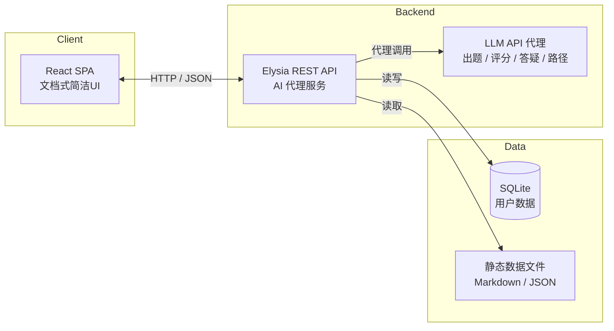

# 架构总览

> 修改记录：执行 lore log docs/architecture/overview.md

---

## §1 系统定位

ArchPrep 是**专为个人使用的系统架构设计师（软考高级 038）备考系统**，覆盖以下四大功能：

| 功能 | 定位 | 目标 |
|:---|:---|:---|
| 学习 | 知识点学习与记忆 | 按教材 20 章组织知识点，用间隔重复高效记忆 |
| 习题 | 选择题练习与错题管理 | 题库为主、AI 补充，识别薄弱点并针对性训练 |
| 写作指导 | 论文写作结构化训练 | 模板、范文、AI 评分形成闭环 |
| 模拟考 | 三科全真模拟 | 综合知识、案例分析、论文三科计时评分与趋势分析 |

系统为**单用户本地/个人部署**设计，不提供注册登录、社交或排行榜功能。

---

## §2 架构原则

1. **文档式简洁 UI**：界面以阅读、练习、写作为核心，避免复杂导航和视觉干扰，优先保证内容密度与专注体验。
2. **AI 后端代理不暴露前端**：所有 LLM 调用统一由 Elysia 后端服务封装，前端不直接访问大模型 API，避免密钥泄漏和版本漂移。
3. **静态数据 Git 维护**：知识点 Markdown、题库 JSON、论文范文等核心备考资料以静态文件形式纳入版本控制，便于内容迭代、回滚和跨设备同步。
4. **个人单用户无鉴权**：系统面向个人使用，不引入账号体系、权限控制或多租户隔离；用户数据通过本地 SQLite 持久化。

---

## §3 系统架构

### 3.1 全景图

### 3.2 技术栈

| 层级 | 技术 | 用途 |
|:---|:---|:---|
| 前端框架 | React 19 + TypeScript | 组件化 UI、类型安全 |
| 前端构建 | Vite（vite-plus） | 开发服务器、构建、HMR |
| 前端组件 | antd 6（[即将替换为 Base UI + Tailwind v4，见 PRD 2026-07-09](../prd/2026-07-09-frontend-refactor-to-base-ui.md)） | 表单、表格、模态、布局 |
| 后端框架 | Elysia + TypeScript | REST API、路由、中间件 |
| 数据库 | SQLite（bun:sqlite） | 用户学习数据持久化 |
| 运行时 | Bun | 后端执行与构建 |
| AI 集成 | LLM API 代理 | 智能出题、论文评分、答疑、学习路径 |
| 部署 | 单容器/本地服务 | 个人部署，简单运维 |

---

## §4 核心模块

| 模块 | 职责 | 关键能力 |
|:---|:---|:---|
| **学习模块** | 知识点体系与记忆调度 | 按教材 20 章组织知识点；SM-2 间隔重复调度卡片复习；AI 知识点答疑；高亮与笔记标注 |
| **习题模块** | 选择题练习与薄弱点训练 | 章节练习、随机出题、错题重练；静态题库 JSON；AI 薄弱点补充出题；错题本与统计分析 |
| **写作指导模块** | 论文写作结构化训练 | 论文模板库、范文库、写作技巧指导；AI 按官方 5 维度评分；在线写作工作台与草稿版本 |
| **模拟考模块** | 三科全真模拟考试 | 综合知识 75 题单选、案例分析 5 选 4、论文 4 选 1；计时评分；成绩记录与趋势分析 |
| **个性化中枢** | 数据驱动的学习推荐 | 薄弱点识别、每日复习推荐、学习路径建议、学习仪表盘 |
| **AI 服务层** | 统一 AI 能力封装 | 智能出题、论文评分、知识点答疑、模拟考案例评分、学习路径生成；所有调用经后端代理 |

模块关系：

- 学习、习题、写作、模拟考四个业务模块产生数据，统一写入 SQLite；
- 个性化中枢读取业务数据，计算薄弱点并生成推荐任务；
- AI 服务层为各业务模块提供出题、评分、答疑、路径生成能力，通过 Elysia 后端暴露给前端。

---

## §5 数据架构

### 5.1 静态数据

静态数据由 Git 维护，支持内容更新与版本回滚：

| 类型 | 文件格式 | 示例路径 | 说明 |
|:---|:---|:---|:---|
| 知识点 | Markdown | `data/knowledge/chapter-01/*.md` | 每章一个目录，每篇为一个知识点 |
| 题库 | JSON | `data/quiz/questions.json` | 题干、选项、答案、解析、章节定位、难度、来源 |
| 范文 | Markdown | `data/writing/samples/*.md` | 10 大高频主题范文，含 AI 点评 |
| 模板 | Markdown/JSON | `data/writing/templates/*.md` | 论文结构模板与写作技巧 |
| 真题导入 | JSON | `data/import/*.json` | 历年真题批量导入数据 |

### 5.2 SQLite 用户数据

| 表 | 用途 |
|:---|:---|
| `review_cards` | 间隔重复卡片：知识点、掌握度、ease factor、间隔、下次复习日期 |
| `quiz_records` | 习题记录：题目、用户答案、正确答案、用时、是否正确、时间戳 |
| `exam_records` | 模拟考记录：科目、分数、用时、提交时间、答题详情 |
| `writings` | 论文草稿与提交：标题、各节内容、字数、评分结果、版本历史 |
| `notes` | 用户笔记与知识点高亮标注 |
| `study_sessions` | 学习会话：日期、学习时长、连续学习天数（streak） |

---
