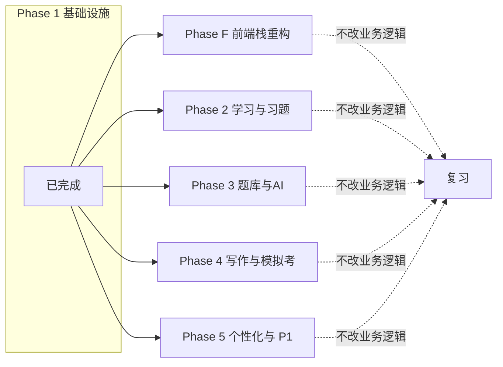

# 前端栈重构（antd 6 → Base UI + Tailwind v4）阶段

> 状态：未开始
> 修改记录：执行 `lore log docs/phase/2026-07-09-frontend-refactor.md`
> 对应 PRD: [ArchPrep 前端栈重构 PRD](../prd/2026-07-09-frontend-refactor-to-base-ui.md)
> 上游 PRD: [ArchPrep PRD v0.4](../prd/2026-07-08-archprep.md)（业务功能不变，仅补 FR-FE-*）
> 上游 Spec: [ArchPrep Spec](../spec/2026-07-08-archprep.md)

## 1. 阶段目标

### 1.1 阶段定位

本阶段是 ArchPrep 项目的 **第 6 个阶段（Phase F）**，与上游 Phase 1-5 并行，业务功能不修改；只替换前端技术栈与写法范式，消除"古老写法 + 重组件 + 静置资产"三大问题。本阶段结束前**不**推迟原 Phase 1-5 的并行执行。

### 1.2 阶段目标

- **目标 1（结构性）**：将 antd 6.5 全部替换为 Base UI 1.x + Tailwind v4；将 30 处裸 `useEffect fetch` 改为 TanStack Query；将手写 store 改为 zustand；将 Eden Treaty 接为业务数据主入口
- **目标 2（资产性）**：让 24 个 monolith page 沿 `features/<x>/` 切片，单文件最大 ≤ 400 行
- **目标 3（合规性）**：AGPL-3.0 借鉴声明、ADR 决策记录、`docs/index.md` 同步、`architecture/overview.md` §3.2 同步

### 1.3 完成标准

> 与 PRD §0.2 / §0.3 等价，作为本阶段关闸判定：

- [ ] PRD §0.2 业务验收开关全勾（27 项功能等价）
- [ ] PRD §0.3 技术验收开关全勾（antd 引用清零、9 个 features 切片、3 个 query/store 单测通过）
- [ ] `vp check` + `vp lint` + `vp test` 三键全绿
- [ ] `vp build` 成功；生产产物大小 ≤ 重构前基线 × 1.20，否则登记 ADR
- [ ] `docs/architecture/decisions/2026-07-09-frontend-refactor-to-base-ui.md` 已发布
- [ ] `docs/index.md` 与 `docs/architecture/overview.md` §3.2 同步
- [ ] 本 Phase §5 验收清单全勾

---

## 2. 任务分解

### 2.1 任务清单

| 任务 ID | 任务名称 | FR 编号 | 优先级 | 依赖 | 状态 |
|:---|:---|:---|:---:|:---|:---:|
| TF-001 | Tailwind v4 + PostCSS + 主题 CSS 变量系统 | FR-FE-02 | P0 | - | 未开始 |
| TF-002 | UI 基础组件库（Base UI + CVA + cn）共 ≥12 组件 | FR-FE-01 / FR-FE-12 | P0 | TF-001 | 未开始 |
| TF-003 | hugeicons 替 @ant-design/icons 全量替换 | FR-FE-12 | P0 | TF-002 | 未开始 |
| TF-004 | vitest + jsdom polyfill 与 smoke 测试基建 | FR-FE-13 | P0 | - | 未开始 |
| TF-005 | TanStack Router 文件式路由 + auth gate | FR-FE-03 | P0 | TF-002 | 未开始 |
| TF-006 | login 路由迁 react-router → TanStack Router | FR-FE-03 | P0 | TF-005 | 未开始 |
| TF-007 | QueryClient + QueryCache.onError + Eden Treaty 主 fetcher | FR-FE-04 / FR-FE-08 | P0 | TF-005 | 未开始 |
| TF-008 | zustand auth store + ui-prefs store + 替换手写 theme.ts | FR-FE-05 | P0 | TF-007 | 未开始 |
| TF-009 | zod schema 替换 11 处手写 type guard | FR-FE-06 | P1 | TF-007 | 未开始 |
| TF-010 | shell 迁移：`AppLayout` → Base UI Sider/Header | FR-FE-03 | P0 | TF-008 | 未开始 |
| TF-011 | features/auth 模块迁移（登录页 → react-hook-form + zod） | FR-FE-07 / FR-FE-09 | P0 | TF-010 | 未开始 |
| TF-012 | features/settings 模块迁移（AIConfig + AICost） | FR-FE-07 | P0 | TF-011 | 未开始 |
| TF-013 | features/data-transfer 模块迁移 | FR-FE-07 | P0 | TF-012 | 未开始 |
| TF-014 | features/stats-progress-history 模块迁移（含 react-table + virtual） | FR-FE-07 / FR-FE-10 | P0 | TF-013 | 未开始 |
| TF-015 | features/knowledge 模块迁移（切片 3 子文件） | FR-FE-07 | P0 | TF-014 | 未开始 |
| TF-016 | features/quiz+error+bank+weakness 模块迁移 | FR-FE-07 | P0 | TF-015 | 未开始 |
| TF-017 | features/exam+review 模块迁移 | FR-FE-07 | P0 | TF-016 | 未开始 |
| TF-018 | features/writing 模块迁移（含 MarkdownRenderer 重写） | FR-FE-07 | P0 | TF-017 | 未开始 |
| TF-019 | features/search+qa+home 模块迁移 | FR-FE-07 | P0 | TF-018 | 未开始 |
| TF-020 | 旧 `apps/admin/src/pages/` 删除 + 旧 `api/client.ts` 删除 | FR-FE-14 | P0 | TF-019 | 未开始 |
| TF-021 | 文档同步：overview.md / index.md / 新 ADR | - | P0 | TF-020 | 未开始 |
| TF-022 | 关键回归：4 场景 walkthrough（登录 / 薄弱-AI选题 / 论文评分 / 模拟考暂停） | FR-FE-全 | P0 | TF-021 | 未开始 |
| TF-023 | ADR 候选 6 条记录填充 | - | P1 | TF-001 | 未开始 |

> 任务规模与 PRD §1.3 成功指标对齐：TF-001 ~ TF-009 为 Phase F.0 + F.1 + F.2；TF-010 ~ TF-019 为 Phase F.3；TF-020 ~ TF-022 为 Phase F.4。

### 2.2 任务详情

#### TF-001: Tailwind v4 + PostCSS + 主题 CSS 变量系统

**任务描述**：建 `apps/admin/postcss.config.js`，写 `apps/admin/src/styles/{index,theme,theme-presets}.css`，含 `:root`/`.dark` CSS 变量与 `@theme inline` 映射。

**验收标准**：
- [ ] `apps/admin/postcss.config.js` 含 `tailwindcss: { config: './tailwind.config.js' }` 但实际**无** `tailwind.config.js`（v4 内联 `@theme`）
- [ ] `theme.css` 含 `--background` `--foreground` `--primary` `--muted` 等基本变量，light + dark 两套
- [ ] `index.css` 使用 `@import "tailwindcss";`
- [ ] `vp dev` 启动后页面正常加载
- [ ] `vp build` 通过

**涉及文档**：
- PRD §3.2.1（FR-FE-02）
- ADR-006（待建，主题持久化决策）

#### TF-002: UI 基础组件库

**任务描述**：在 `apps/admin/src/components/ui/` 沉淀 ≥ 12 个基础组件，基于 `@base-ui/react` 与 `class-variance-authority`，以 `cn()` 工具函数合并类名。

**验收标准**：
- [ ] `apps/admin/src/lib/utils.ts` 含 `cn = twMerge(clsx(...))`
- [ ] `button.tsx`、`card.tsx`、`input.tsx`、`textarea.tsx`、`select.tsx`、`dialog.tsx`、`drawer.tsx`、`tooltip.tsx`、`toast.tsx`（基于 sonner）、`dropdown.tsx`、`avatar.tsx`、`skeleton.tsx` 至少 12 个文件存在且导出
- [ ] `button.tsx` 含 vitest smoke（点击 -> 回调被调）

**涉及文档**：
- PRD §3.2.1 FR-FE-01
- 架构总览 §3.2（待 TF-021 同步）

#### TF-003: hugeicons 替换 @ant-design/icons

**任务描述**：替换 24 个 page 中所有 `@ant-design/icons` 引用为 `@hugeicons/core-free-icons`。

**验收标准**：
- [ ] `grep -rE "from ['\"]@ant-design/icons['\"]" apps/admin/src` 返回 0 行
- [ ] `apps/admin/package.json` 删除 `@ant-design/icons` 与 `@ant-design/v5-patch-for-react-19`

**涉及文档**：PRD §0.3 第 2 条

#### TF-004: vitest + jsdom polyfill

**任务描述**：配置 `apps/admin/vitest.config.ts`，polyfill jsdom 适配 antd 6 + React 19 历史 smoke 仍可用。

**验收标准**：
- [ ] `apps/admin/vitest.config.ts` 含 `environment: "jsdom"` 及 jsdom polyfill（`window.matchMedia`、`ResizeObserver`、`getComputedStyle`）
- [ ] 1 个占位 smoke 用例通过（`pnpm vitest --run`）
- [ ] 后续 TF-007 / TF-008 / TF-009 / TF-011 起每个新增 hook/store 配 ≥ 1 用例

**涉及文档**：PRD §0.3 第 8 条

#### TF-005: TanStack Router 文件式路由 + auth gate

**任务描述**：`apps/admin/src/routes/{__root.tsx, _authenticated/route.tsx, (auth)/login.tsx, _authenticated/index.tsx}`。

**验收标准**：
- [ ] `routes/__root.tsx` 含 `<Outlet/>` 和 devtools 入口
- [ ] `_authenticated/route.tsx#beforeLoad` 调用 `useAuthStore.getState().auth.user`，未登录跳 `/login`
- [ ] `main.tsx` 改为 `<RouterProvider>` 替代 `<Routes>`
- [ ] 跨页面跳转未登录态自动回 `/login`

**涉及文档**：PRD §3.2.2 FR-FE-03

#### TF-006: login 路由迁移

**任务描述**：把原 `pages/LoginPage` 内容迁到 `routes/(auth)/login.tsx`，UI 用 Base UI + 自写组件。

**验收标准**：
- [ ] `apps/admin/src/pages/LoginPage.tsx` 已 `git rm`
- [ ] 登录页主要交互与 PRD v0.4 §3.2.1 一致（验证码发送 / 60s 倒计时 / JWT 接收）

**涉及文档**：PRD §3.2.2 / §3.2.3

#### TF-007: QueryClient + QueryCache.onError + Eden Treaty 主 fetcher

**任务描述**：建 `apps/admin/src/lib/query-client.ts` 和 `apps/admin/src/lib/api.ts`，以 Eden Treaty 为底。

**验收标准**：
- [ ] `query-client.ts`：`staleTime: 10_000`、`refetchOnWindowFocus: false`、`retry: (failureCount, error) => …` 排除 401/403
- [ ] `QueryCache.onError` 拦截 401：触发 `useAuthStore.getState().auth.reset` + `window.location.assign("/login")`
- [ ] `api.ts`：`treaty<App>` 导出，`headers()` 注入 `Authorization: Bearer ${token}`
- [ ] `apps/admin/src/api/eden.ts` **保留并去掉内部 token 状态**，由 `api.ts` 统一持有（或合并）

**涉及文档**：PRD §3.2.3 FR-FE-04 / FR-FE-08

#### TF-008: zustand auth store + ui-prefs store

**任务描述**：替换原手写 `store/theme.ts` 为 zustand store，并新增 `auth.ts` / `ui-prefs.ts`。

**验收标准**：
- [ ] `stores/auth.ts`、`stores/ui-prefs.ts` 已建立
- [ ] `stores/theme.ts` 迁后 ≤ 30 行；其中**不再持有** 私有 `Set<callback>` 订阅结构
- [ ] 旧 `useThemeMode()` 行为兼容：`(mode, setMode)` 元组签名不变
- [ ] 新 store 配 vitest：selector 窄选、reset 行为

**涉及文档**：PRD §3.2.3 FR-FE-05

#### TF-009: zod schema 替换 11 处 type guard

**任务描述**：为 11 处手写 type guard 建 zod schema，从 server 类型推导字段名。

**验收标准**：
- [ ] 11 处 `function is*(value): value is *` 全部 `git rm`
- [ ] `features/<x>/lib/schema.ts` 等至少 9 个 zod schema 文件存在
- [ ] 与 server `App` 类型的字段名 100% 对齐（手动核验）

**涉及文档**：PRD §3.2.3 FR-FE-06

#### TF-010: shell 迁移

**任务描述**：把 `components/layout/AppLayout.tsx` 迁到 `routes/_authenticated/route.tsx` 同级 layout 或 `components/layout/AppShell.tsx`，sider 208px、header 56px、内容响应式。

**验收标准**：
- [ ] 旧 `AppLayout.tsx` 已 `git rm`
- [ ] 新 shell 无 antd 引用
- [ ] 视觉风格与 antd 时代语义映射（颜色变量、间距），不要求像素一致
- [ ] 移动端 Sider break point 保留（< 768px 折叠）

**涉及文档**：PRD §7

#### TF-011 ~ TF-019: features 切片（详见 PRD §3.2.4）

每个 features 子树按 PRD §3.2.4 模板建立，单模块完成判定：
- [ ] `grep -rE "from ['\"]antd['\"]" apps/admin/src/features/<x>/` 返回 0
- [ ] 对应原 page 已 `git rm`
- [ ] 至少 1 个 vitest 单测覆盖

> 切分顺序：auth → settings → data-transfer → stats-progress-history → knowledge → quiz+error+bank+weakness → exam+review → writing → search+qa+home

**重点任务**：
- TF-014：大表（StatsPage/ProgressPage/ExamHistoryPage）改 `@tanstack/react-table` + `react-virtual`
- TF-015：`KnowledgePage.tsx` 拆 3 子文件（chapter-tree / kp-viewer / annotation-panel）
- TF-018：`MarkdownRenderer.tsx` 重写为基于 `react-markdown` + Tailwind prose，不再依赖 antd `theme.useToken`

#### TF-020: pages/ 目录 + api/client.ts 删除

**验收标准**：
- [ ] `git rm -r apps/admin/src/pages/`
- [ ] `git rm apps/admin/src/api/client.ts`（确认登录兼容 shim 已被 TF-006 TF-008 接管）
- [ ] `apps/admin/src/api/eden.ts` 与 `lib/api.ts` 合并/收敛为单文件

#### TF-021: 文档同步

**验收标准**：
- [ ] `docs/architecture/overview.md` §3.2 技术栈表更新：antd 6 → Base UI 1.x + Tailwind v4
- [ ] `docs/index.md` 加入本 Phase F 与新 PRD 索引
- [ ] `docs/architecture/decisions.md` 加入 ADR 占位（指向 `decisions/2026-07-09-frontend-refactor-to-base-ui.md`）
- [ ] 新建 ADR 文件，含 ADR-001 ~ 006

#### TF-022: 关键回归 4 场景

**验收标准**：
- [ ] 场景 A（登录）：邮箱验证码 → JWT → 首页渲染 ≤ 2 s
- [ ] 场景 B（薄弱→AI 选题）：错题入册 → 薄弱点触发 → 题目推荐 → 练习记录
- [ ] 场景 C（论文评分）：分节编辑器 → AI 5 维度评分（流式）
- [ ] 场景 D（模拟考暂停）：综合知识 75 题 → 暂停（answers_snapshot + remaining_time）→ 继续

#### TF-023: ADR 6 条候选填充

**验收标准**：
- [ ] ADR-001 UI 库选择
- [ ] ADR-002 HTTP 入口
- [ ] ADR-003 状态层
- [ ] ADR-004 路由
- [ ] ADR-005 数据层
- [ ] ADR-006 主题持久化（cookie vs localStorage）

---

## 3. 里程碑

| 里程碑 | 日期 | 交付物 | 状态 |
|:---|:---:|:---|:---:|
| M-F.0 基建完成 | 2026-07-12 | TF-001 ~ TF-004 + ADR-006 | 未达成 |
| M-F.1 壳层完成 | 2026-07-19 | TF-005 ~ TF-010 + 4 模块 TF-011 ~ TF-013 | 未达成 |
| M-F.2 数据/状态完成 | 2026-07-24 | TF-007 ~ TF-009 | 未达成 |
| M-F.3 模块迁移完成 | 2026-09-05 | TF-014 ~ TF-019（5 个 features） | 未达成 |
| M-F.4 收尾完成 | 2026-09-12 | TF-020 ~ TF-023 + PRD §0.2/§0.3 全勾 | 未达成 |
| M-F.5 演练 Buffer | **2026-09-15 硬截止** | 全部回归走通 | 未达成 |

---

## 4. 风险与问题

### 4.1 阶段风险

| 风险 | 影响 | 概率 | 应对措施 | 责任人 |
|:---|:---:|:---:|:---|:---:|
| TanStack Router `beforeLoad` 与 Elysia cookie auth 行为差异 | 中 | 中 | TF-005 配 vitest 拦截用例 | 实施者 |
| Base UI 与 antd 视觉差异过大 | 中 | 中 | TF-022 walkthrough 接受/回退 | 实施者 |
| Eden Treaty `App = typeof app` 不满足 `extends Elysia` | 高 | 中 | TF-007 跑 `vp check`，TS2339 即查 `elysia-treaty-elysia-not-installed-diagnosis` skill | 实施者 |
| 2026-09-15 deadline 推后 | 高 | 中 | TF-022 9 月中旬回归若失败，**强制收尾**仅完成 features 1-3 | 实施者 |
| 单人维护 2-3 周不可达 | 高 | 中 | 砍 TF-014/TF-018 等 P1 任务至 P2 | 实施者 |
| `@base-ui/react` 在 React 19 RSC 模式下 rerender 异常 | 中 | 低 | TF-002 每个组件含 1 个 useState/render smoke | 实施者 |
| AGPL 合规误解 | 低 | 低 | 详见 PRD §11.1 | 文档 |

### 4.2 待解决问题

| 问题 | 影响范围 | 优先级 | 状态 | 责任人 |
|:---|:---|:---:|:---:|:---:|
| 是否在 Phase F 内一并把 access/refresh token 从 localStorage 迁 cookie | 登录态持久化 | 中 | 待 TF-005 决策 | 实施者 |
| 是否保留 `@ant-design/icons` 兼容（双轨） | 5+ 处 icon | 低 | 倾向"全清" | 实施者 |
| 是否启用 `@visactor/vchart` 替 antd 折线图（FR-FE-11） | Stats / Progress | 低 | 倾向"先 P2 跳过" | 实施者 |

---

## 5. 验收

### 5.1 验收清单

> 与 PRD §0.2 §0.3 §5 对齐：

- [ ] antd + `@ant-design/icons` + `@ant-design/v5-patch-for-react-19` 在 `apps/admin/package.json` 已删除
- [ ] `from "antd"` 命中 0 行
- [ ] `from "@ant-design/icons"` 命中 0 行
- [ ] `apps/admin/src/pages/` 目录已 `git rm`
- [ ] `apps/admin/src/api/client.ts` 已 `git rm`
- [ ] `apps/admin/src/components/ui/` ≥ 12 个基础组件
- [ ] `apps/admin/src/features/` ≥ 9 个 features
- [ ] Eden Treaty 调用站点 ≥ 20
- [ ] zod schema 替换 11 处 type guard
- [ ] `vp check` + `vp lint` + `vp test` 三键全绿
- [ ] `vp build` 成功，bundle ≤ 重构前基线 × 1.20
- [ ] 关键 4 场景回归 walkthrough 通过
- [ ] 文档同步完成：`docs/index.md` / `docs/architecture/overview.md` §3.2 / 新 ADR

### 5.2 验收记录

| 验收项 | 验收人 | 验收日期 | 结果 | 备注 |
|:---|:---|:---:|:---:|:---|
| 待 TF-022 ~ TF-023 完成后填写 | @zhiming3399 | - | - | - |

---

## 6. 依赖与协作

### 6.1 前置依赖

- [x] ArchPrep PRD v0.4 已发布（含上游 35 项 FR）
- [x] ArchPrep Spec 已发布
- [x] Phase 1（基础设施与用户）已完成
- [ ] Phase 2（学习与习题核心）状态 — 暂未开始，不阻塞 Phase F
- [ ] Phase 3-5 — 暂未开始，不阻塞 Phase F

> **结论**：Phase F 与 Phase 2-5 **并行**。Phase F 不依赖任何业务 Phase 的状态（仅依赖 FR-FE-* 编号的一致性）；业务 Phase 2-5 在 Phase F 落地后**不需要**回头修改业务逻辑，因为 Phase F 保留全部旧业务行为。

### 6.2 协作需求

| 协作方 | 协作内容 | 时间节点 | 状态 |
|:---|:---|:---:|:---:|
| 上游 PRD 维护者（@zhiming3399） | 批准 PRD §0.2 §0.3 验收开关 | 2026-07-10 | 待开始 |
| 后端维护者（@zhiming3399） | 确认 server `App = typeof app` 满足 `extends Elysia` | 2026-07-19（TF-007 起步） | 待开始 |
| 文档维护 | ADR-001 ~ 006 写作 | TF-023 期间（2026-09-05 起） | 待开始 |

### 6.3 与上游 Phase 1-5 的关系

> **关键不变量**：Phase F 替换栈但保留业务逻辑；Phase 2-5 推进业务功能但保留栈/路由/数据层的现状直到 Phase F 收尾。两者**只在 §0 验收开关重叠**。

### 6.4 与上游 ADR 的关系

- ADR 候选 `2026-07-09-frontend-refactor-to-base-ui.md` 包含 ADR-001 ~ 006，主题：
  - ADR-001 UI 库选择
  - ADR-002 HTTP 入口
  - ADR-003 状态层
  - ADR-004 路由
  - ADR-005 数据层
  - ADR-006 主题持久化

- 已有 ADR `2026-07-08-*` 未涉及 UI 库选择，**没有冲突**。

---

## 7. 附：本 Phase 与 PRD 双向引用矩阵

| PRD 章节 | 本 Phase 任务 | 状态 |
|:---|:---|:---:|
| PRD §3.2.1 (FR-FE-01/02/12) | TF-001 / TF-002 / TF-003 | 锚定 |
| PRD §3.2.2 (FR-FE-03) | TF-005 / TF-006 / TF-010 | 锚定 |
| PRD §3.2.3 (FR-FE-04/05/06/08) | TF-007 / TF-008 / TF-009 | 锚定 |
| PRD §3.2.4 (FR-FE-07/09/10/11) | TF-011 ~ TF-019 | 锚定 |
| PRD §3.1 (FR-FE-13/14) | TF-004 / TF-020 | 锚定 |
| PRD §0.2 / §0.3 验收开关 | TF-022 + §5.1 验收清单 | 锚定 |
| PRD §10.2 上线前准备 | TF-021 + TF-023 | 锚定 |
