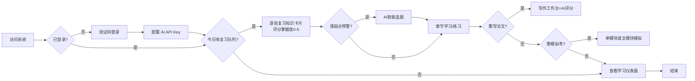
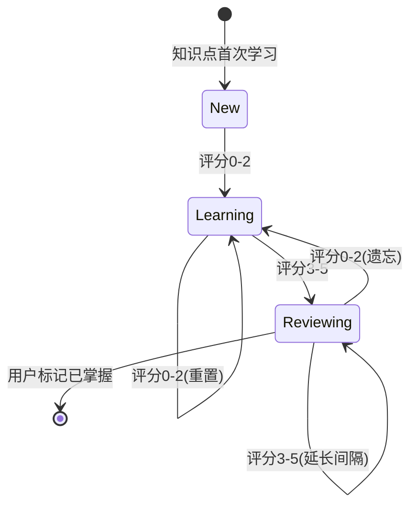
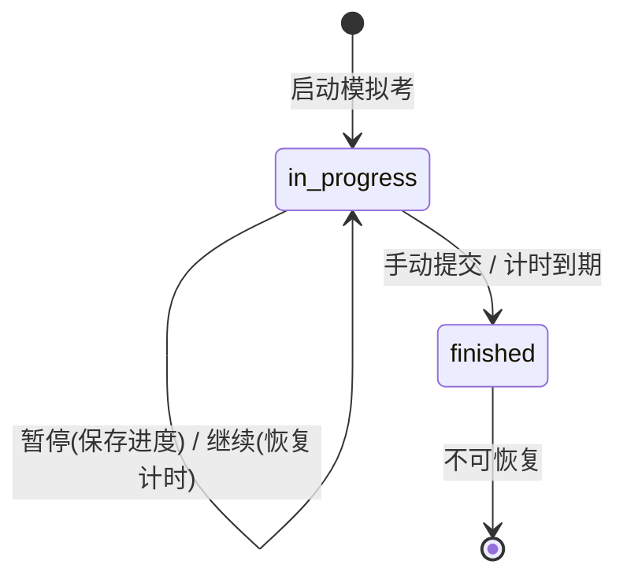
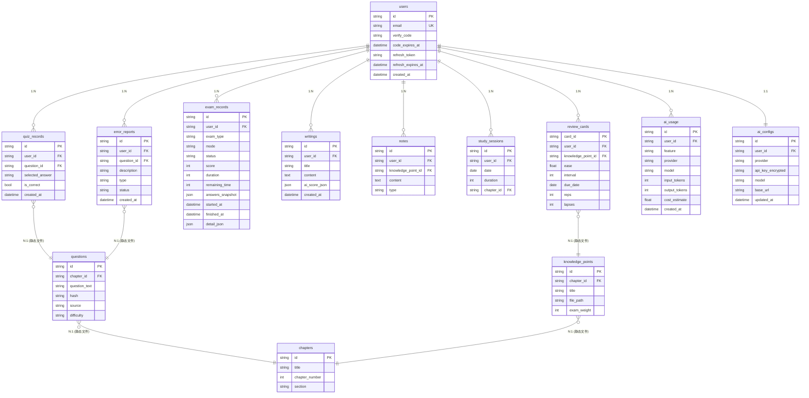

# ArchPrep（系统架构设计师备考系统）PRD v0.4

> 状态：草稿
> 归档日期：-
> 修改记录：执行 `lore log docs/prd/2026-07-08-archprep.md`
> 对应阶段: [Phase 1: 基础设施与用户模块](../phase/2026-07-08-foundation.md)

---

## 0. 目标声明与验收开关（sdd-prd 必填 · 归档触发器）

> **本节是归档触发器**--agent 加载 PRD 时必读。
> 目标达成后，本节验收开关全部勾选，触发归档流程。

### 0.1 目标陈述

> 这份 PRD 是为达成**通过系统架构设计师（软考高级038）考试**而存在。
>
> **目标达成时间窗口**：2026年11月（下半年考试）之前系统可用
> **目标达成的判定**：见下方验收开关

构建一套备考系统，覆盖学习（SM-2 间隔重复）、习题（题库+AI智能选题+远程拉取）、写作指导（论文AI评分）、模拟考（单/全模块）四大功能。采用 Vercel AI SDK 多模型适配（用户级 API Key），邮件验证码登录支持跨端同步，本机部署 + cloudflared 开放外网。

### 0.2 业务验收开关

- [ ] 20 章知识点可按教材结构浏览，5分制标注考试重点，支持 AI 答疑
- [ ] SM-2 间隔重复队列连续 7 天正确调度
- [ ] 三种练习模式（章节/随机/错题）正常出题，错题自动收录
- [ ] 薄弱点（正确率<60%）触发 AI 智能选题，推荐题目来自现有题库
- [ ] 论文模板 + 10 大高频主题范文齐全
- [ ] AI 论文 5 维度评分（切题30%/应用深度20%/实践性20%/表达15%/综合15%）可用
- [ ] 模拟考支持单模块和全模块两种模式，支持暂停/继续
- [ ] 案例分析和论文模拟考均有 AI 评分（含案例题4维度评分）
- [ ] 数据驱动薄弱点推荐合理（基于正确率+模考成绩）
- [ ] 题库拉取与去重可用（远程 URL 拉取 + SHA-256 去重）
- [ ] 案例题/论文题库可拉取，AI 评分标准明确
- [ ] 退出登录清除 token
- [ ] 知识点全文搜索可用
- [ ] 历年真题（2009-2025）可导入
- [ ] 深色模式 + 移动端核心功能可用
- [ ] 学习仪表盘聚合复习队列/天数/预警/成绩

### 0.3 技术验收开关

- [ ] vite-plus 全栈（React + Elysia + SQLite）可本地启动运行
- [ ] Vercel AI SDK 多模型适配（OpenAI/Anthropic/DeepSeek/MiniMax/Kimi），用户级 API Key 配置
- [ ] API Key 加密存储在 SQLite，前端不接触 Key
- [ ] 邮件验证码登录 + JWT 鉴权可用，支持跨端同步
- [ ] JWT + refresh token 续期机制可用
- [ ] cloudflared 隧道可开放外网访问（HTTPS）
- [ ] SMTP 邮件服务可发送验证码邮件
- [ ] 静态数据（知识点 Markdown / 题库 JSON / 范文 MD）Git 维护
- [ ] 用户数据 SQLite 持久化，按 user_id 隔离
- [ ] 页面首屏 <2s，AI 响应 <30s（含超时重试）
- [ ] AI 降级时核心功能（题库练习/知识点浏览/间隔重复）不受影响
- [ ] CORS 配置正确，仅允许已知来源

### 0.4 归档条件

> 业务验收开关 + 技术验收开关全部勾选 = 可触发归档。

> **当前状态（截至 2026-07-09）**：本主 PRD `§0.2` `§0.3` 共 17 + 12 = 29 项验收开关**不**可全勾。
> 原因：FR-LR-02 SM-2 / FR-WR-03 AI 论文评分 / FR-EX-02-03 模考 AI 评分 / FR-PF-* 个性化中枢 等 P0 项未交付，归属 Phase 2-5 + Phase F。
>
> **分阶段归档策略**：为避免"打勾即视为完成"的漂移，已交付的 Phase 1 范围（FR-US-01/02/03 + FR-SY-01/02 + 6 项技术约束）锁定到独立的**归档子 PRD**：`docs/prd/archive/2026-07-09-p1-foundation-archive.md`。主 PRD 保持"草稿"状态直至期末或全 P0 项落地。

---

## 1. 背景与目标

### 1.1 业务背景

系统架构设计师（软考高级，代码 038）考试自 2023 年上半年起启用第二版官方教材，近 15 年来首次重大改版，旧版资料失效。

| 科目 | 形式 | 时长 | 题量 | 满分 | 合格线 |
|:---|:---|:---|:---|:---|:---|
| 综合知识 | 单选题 | 150 min | 75 题 | 75 | 45 |
| 案例分析 | 5 选 4 主观题 | 90 min | 4 题 | 75 | 45 |
| 论文 | 4 选 1 写作 | 120 min | 1 篇（2000-3000 字） | 75 | 45 |

三科需同时 ≥45 分方可通过。教材分上篇（综合知识 1-11 章）与下篇（案例分析 12-20 章）共 20 章，体量大、知识点分散。论文评分含 5 维度（切题 30%/应用深度 20%/实践性 20%/表达 15%/综合 15%），需结构化训练。

备考痛点：知识点分散无体系、遗忘曲线导致记忆低效、缺乏针对性练习与薄弱点反馈、案例与论文无结构化训练、无法全真模拟。

### 1.2 产品目标

构建备考系统，覆盖学习、习题、写作指导、模拟考四大功能。支持邮件验证码登录与跨端同步，AI 能力通过 Vercel AI SDK 多模型适配，用户自行配置 API Key。

### 1.3 成功指标

- 四大功能模块全部可用，覆盖三科考试全流程
- 间隔重复算法有效辅助知识点记忆（连续 7 天队列正确）
- AI 评分对论文/案例给出可操作的反馈
- 数据驱动推荐能识别薄弱章节并智能选题
- 模拟考支持单模块和全模块两种模式，支持暂停/继续
- 注册制支持跨端同步，桌面+移动自适应

---

## 2. 用户与场景

### 2.1 目标用户

| 用户角色 | 描述 | 核心诉求 |
|---------|------|---------|
| 注册用户 | 通过邮件验证码登录的备考者，软件工程背景 | 高效记忆考点、针对性练习、论文结构化训练、全真模拟、跨端同步 |

开放注册，任何人均可通过邮箱验证码登录。用户数据按 user_id 隔离。

### 2.2 使用场景



---

## 3. 功能需求

### 3.1 功能清单

**P0（必须实现）**

| 功能模块 | 功能点 | 编号 | 说明 |
|---------|--------|------|------|
| 用户 | 邮件验证码登录 | FR-US-01 | 邮箱验证码登录，首次自动注册，JWT+refresh token |
| 用户 | 退出登录 | FR-US-03 | 清除 JWT，返回登录页 |
| 用户 | AI 配置 | FR-US-02 | 用户级 API Key，多模型选择（OpenAI/Anthropic/DeepSeek/MiniMax/Kimi） |
| 学习 | 知识点体系管理（20章） | FR-LR-01 | 按教材结构组织，考试重点5分制标注，逐章调研总结 |
| 学习 | 间隔重复调度（SM-2） | FR-LR-02 | 每日复习队列，自动安排下次复习 |
| 习题 | 选择题练习模式 | FR-QZ-01 | 章节/随机/错题三模式 |
| 习题 | 题库管理+真题导入 | FR-QZ-02 | 静态 JSON，先拉取开源仓库真题转化，支持远程拉取 |
| 习题 | 错题本 | FR-QZ-04 | 自动收录，可标记已掌握 |
| 习题 | 练习统计分析 | FR-QZ-05 | 知识点/章节正确率，薄弱点识别 |
| 习题 | 案例题/论文题库 | FR-QZ-08 | 调研拉取案例题和论文题库，含 AI 评分标准 |
| 习题 | 题库拉取与去重 | FR-QZ-06 | 从远程源拉取题库，自动去重 |
| 写作指导 | 论文模板库 | FR-WR-01 | 摘要+正文四段框架，含字数提示 |
| 写作指导 | 范文库 | FR-WR-02 | 10大高频主题，含点评 |
| 写作指导 | AI 论文评分 | FR-WR-03 | 5维度评分+逐段点评+改进建议 |
| 写作指导 | 论文写作工作台 | FR-WR-05 | 分节编辑器，实时字数，草稿保存，支持多篇论文独立保存 |
| 模拟考 | 模拟考模式选择 | FR-EX-00 | 单模块（单科）/ 全模块（综合+案例连续，论文单独） |
| 模拟考 | 暂停/继续 | FR-EX-00b | 支持暂停保存进度，继续恢复计时 |
| 模拟考 | 综合知识模拟考 | FR-EX-01 | 75题计时150min，自动评分 |
| 模拟考 | 案例分析模拟考 | FR-EX-02 | 5选4计时90min，AI评分 |
| 模拟考 | 论文模拟考 | FR-EX-03 | 4选1计时120min，AI评分 |
| 个性化 | 薄弱点识别 | FR-PF-01 | 正确率<60%或模考得分率<50% |
| 个性化 | 学习仪表盘 | FR-PF-03 | 首页聚合复习队列/天数/预警/成绩 |
| 系统 | 主题与响应式 | FR-SY-01 | 深色/浅色切换，移动自适应 |
| 系统 | 数据持久化 | FR-SY-02 | SQLite 用户数据，按 user_id 隔离 |

**P1（早期做）**

| 功能模块 | 功能点 | 编号 | 说明 |
|---------|--------|------|------|
| 学习 | 学习进度追踪 | FR-LR-03 | 章节完成度、掌握度热力图、连续天数 |
| 学习 | AI 知识点答疑 | FR-LR-04 | 对话式追问，引用教材章节 |
| 学习 | 知识点搜索 | FR-LR-06 | 全文搜索知识点标题和正文 |
| 习题 | AI 智能选题 | FR-QZ-03 | 薄弱点触发，从题库筛选相关题目（不生成新题） |
| 习题 | 题目仓库级编辑 | FR-QZ-07 | 题目修正通过 Git 仓库编辑静态 JSON，应用内提供「报告错误」 |
| 写作指导 | 写作技巧指导 | FR-WR-04 | 历年题目汇总、选题策略、母版项目 |
| 模拟考 | 成绩记录与趋势 | FR-EX-04 | 历次记录，分数曲线，合格线对标 |
| 个性化 | 复习推荐 | FR-PF-02 | 薄弱程度×考试权重，每日推荐 |
| 个性化 | 学习提醒 | FR-PF-04 | 邮件提醒复习队列（间隔重复到期） |
| 系统 | 数据导入导出 | FR-SY-03 | JSON 备份/恢复 |
| 系统 | AI 成本展示 | FR-SY-04 | 展示 AI 调用 token 消耗和估算费用 |

**P2（可推迟）**

| 功能模块 | 功能点 | 编号 | 说明 |
|---------|--------|------|------|
| 学习 | 知识点重点标注 | FR-LR-05 | 高亮、笔记、疑问 |

### 3.2 详细功能描述

#### 3.2.1 邮件验证码登录（FR-US-01）

**功能说明**：用户通过邮箱接收验证码登录，JWT 鉴权支持跨端同步。首次登录自动创建账号。

**输入/前置条件**：
- SMTP 邮件服务已配置
- 用户输入邮箱

**处理逻辑**：
1. 用户输入邮箱，请求验证码
2. 后端校验邮箱格式，生成 6 位验证码
3. SMTP 发送验证码邮件（有效期 5 分钟，发送间隔 60s）
4. 用户输入验证码
5. 验证通过后签发 JWT（有效期 7 天），同时签发 refresh token（有效期 30 天），前端存储 access token 与 refresh token
6. 首次登录自动创建账号（无需注册流程）
7. 后续请求携带 JWT，后端验证 user_id
8. JWT 过期时，前端用 refresh token 自动申请续期，无需重新获取验证码；refresh token 过期后才需重新验证码登录

**输出/后置条件**：
- 用户账号自动创建/登录，数据按 user_id 隔离
- JWT 有效期内免登录，跨端同步数据

**异常处理**：
- 验证码错误：提示"验证码错误"
- 验证码过期：提示"验证码已过期，请重新获取"
- 发送频率限制：60s 内不可重复发送
- 验证码邮件发送失败：提示重试

#### 3.2.2 退出登录（FR-US-03）

**功能说明**：用户主动退出登录，清除前端 JWT token。

**处理逻辑**：
1. 前端清除 JWT token 和 refresh token
2. 跳转到登录页
3. 后端可选：将 token 加入黑名单

#### 3.2.3 AI 配置（FR-US-02）

**功能说明**：用户在设置页配置 AI provider、API Key、模型，支持多模型适配。

**输入/前置条件**：
- 用户已登录
- 用户拥有 LLM 服务的 API Key

**处理逻辑**：
1. 用户在设置页选择 provider（OpenAI/Anthropic/DeepSeek/MiniMax/Kimi/自定义）
2. 输入 API Key
3. 后端加密存储 API Key（AES-256），关联 user_id
4. 可选：配置自定义 base URL（OpenAI 兼容服务）
5. 可选：选择默认模型
6. 提供「测试连接」功能，验证 Key 有效性

**输出/后置条件**：
- API Key 加密存储在 SQLite
- AI 功能（选题/评分/答疑）使用用户配置的 provider
- 前端不接触 API Key

**异常处理**：
- API Key 无效：提示"验证失败，请检查 Key"
- 加密存储失败：提示重试

#### 3.2.4 知识点体系管理（FR-LR-01）

**功能说明**：按官方教材 20 章结构组织知识点，逐章调研总结，考试重点用5分制标注（1-5分，5分为最高频考点）。

**输入/前置条件**：
- 知识点 Markdown 文件已按章节目录组织
- 考试重点标注（1-5分）已配置

**处理逻辑**：
1. 解析知识点目录结构（篇->章->节->知识点）
2. 渲染树形导航，标注考试重点（5分=红/4分=橙/3分=黄/2分=浅灰/1分=灰）
3. 点击知识点节点，展示 Markdown 正文

**输出/后置条件**：
- 用户可按章节树形结构浏览全部 20 章知识点
- 5分制标注准确反映考试重点

**异常处理**：
- 知识点文件缺失：显示"内容待补充"占位
- Markdown 解析失败：显示原始文本

#### 3.2.5 知识点搜索（FR-LR-06）

**功能说明**：全文搜索知识点标题和正文，快速定位。

**处理逻辑**：
1. 用户输入关键词
2. 搜索知识点标题和正文（SQLite FTS 或 LIKE）
3. 返回匹配结果列表，高亮关键词
4. 点击结果跳转知识点详情

#### 3.2.6 间隔重复调度 SM-2（FR-LR-02）

**功能说明**：用 SM-2 算法变体管理知识卡片复习。

**输入/前置条件**：
- 知识点已转化为复习卡片（card_id ↔ knowledge_point_id ↔ user_id）
- 卡片初始状态：ease=2.5, interval=1, due_date=今天

**处理逻辑**：
1. 每日生成「今日复习队列」（due_date ≤ 今天的卡片，按到期日排序）
2. 用户复习后评分（0-5）：
   - 0-2（遗忘）：interval=1, ease×=0.8
   - 3（困难）：interval×=1.2
   - 4（良好）：interval×=ease
   - 5（简单）：interval×=ease×=1.3
3. ease 下限 1.3，上限 3.0
4. 更新 due_date = 今天 + interval

**输出/后置条件**：
- 复习队列按 SM-2 算法正确调度
- 遗忘卡片重置间隔为 1 天

**异常处理**：
- 卡片数据损坏：跳过该卡片，记录错误日志

#### 3.2.7 学习进度追踪（FR-LR-03）

**功能说明**：追踪用户学习进度，展示章节完成度和掌握度。

**处理逻辑**：
1. 按章节统计：已学知识点数/总知识点数、平均掌握度（基于 SM-2 评分）
2. 按时间统计：每日学习时长、连续学习天数（streak）
3. 可视化：章节掌握度热力图、学习日历

**输出/后置条件**：
- 进度数据实时更新
- 热力图准确反映各章节掌握状态

#### 3.2.8 AI 知识点答疑（FR-LR-04）

**功能说明**：用户在知识点详情页发起追问，AI 基于该知识点上下文作答。

**输入/前置条件**：
- 用户已配置 AI API Key
- 当前知识点上下文已知

**处理逻辑**：
1. 用户在知识点详情页输入问题
2. 构建 Prompt：知识点教材原文 + 用户问题
3. 通过 Vercel AI SDK 调用，流式返回回答
4. 回答标注引用章节，避免超纲

**异常处理**：
- AI 服务超时：提示重试
- 用户未配置 API Key：提示"请先在设置中配置 AI"

#### 3.2.9 选择题练习模式（FR-QZ-01）

**功能说明**：三模式选择题练习（章节/随机/错题重练）。

**输入/前置条件**：
- 题库 JSON 已加载
- 用户选择练习模式

**处理逻辑**：
1. **章节练习**：按选定章节顺序/随机出题
2. **随机出题**：跨章节随机抽取（10/20/50 题可选）
3. **错题重练**：从错题本抽取未标记「已掌握」的题
4. 每题展示题干+选项，提交后显示答案+解析+教材章节定位

**输出/后置条件**：
- 做错的题自动入错题本
- 练习记录写入 quiz_records

**异常处理**：
- 题库为空：提示"请先导入题库"

#### 3.2.10 题库管理+真题导入（FR-QZ-02）

**功能说明**：题库以静态 JSON 文件存储，支持开源仓库真题转化和远程拉取。

**处理逻辑**：
1. 题库文件按 §6.3 格式标准组织（选择题/案例题/论文题分别存储）
2. 真题导入：从 GitHub 开源仓库（xxlllq/system_architect 等）拉取真题，转化为标准 JSON Schema
3. 远程拉取：复用 FR-QZ-06 的远程拉取+去重机制
4. 题库可按章节/难度/来源/年份筛选

**异常处理**：
- 转化格式不符：提示具体字段缺失
- 拉取失败：提示重试

#### 3.2.11 AI 智能选题（FR-QZ-03）

**功能说明**：薄弱知识点触发 AI 从题库中筛选相关题目推荐练习。不生成新题，不落库。

**输入/前置条件**：
- 某知识点练习正确率 < 60%
- 用户已配置 AI API Key
- 题库中有该知识点相关的题目

**处理逻辑**：
1. 检测薄弱知识点（正确率 < 60%）
2. 构建 Prompt：薄弱知识点信息 + 题库中该章节的题目列表（题干+章节）
3. AI 从已有题目中筛选最相关的 5-10 道题推荐
4. 用户做推荐的题目，结果记录到 quiz_records
5. 不生成新题，不修改题库

**输出/后置条件**：
- 推荐的题目来自现有题库（标记来源不变）
- 练习记录正常写入

**异常处理**：
- AI 服务超时：提示重试
- 题库中无相关题目：提示「该章节题库不足，请先拉取更多题目」
- 用户未配置 API Key：提示「请先在设置中配置 AI」

#### 3.2.12 错题本（FR-QZ-04）

**功能说明**：自动收录做错的题目，支持标记已掌握和按章节筛选。

**处理逻辑**：
1. 做错题自动入册，记录：题目、错误选项、正确答案、错误时间、已复习次数
2. 错题可标记「已掌握」，移出复习队列
3. 支持按章节/时间筛选

**输出/后置条件**：
- 标记已掌握后不再出现在错题重练队列

#### 3.2.13 练习统计分析（FR-QZ-05）

**功能说明**：统计知识点和章节维度的正确率，识别薄弱点。

**处理逻辑**：
1. 知识点维度：每个知识点的累计正确率、练习次数
2. 章节维度：章节平均正确率、薄弱章节排序
3. 时间维度：练习趋势曲线
4. 薄弱点识别：正确率 < 60% 的知识点自动标记，推送至个性化中枢

**输出/后置条件**：
- 薄弱点列表与实际练习数据一致

#### 3.2.14 题库拉取与去重（FR-QZ-06）

**功能说明**：从远程源（GitHub raw URL 等）拉取题库 JSON，自动去重后合并入库。

**输入/前置条件**：
- 用户提供题库源 URL（GitHub raw JSON 格式）
- 题库格式符合 §6.3 题库格式标准

**处理逻辑**：
1. 用户在题库管理页输入远程 URL
2. 后端拉取 JSON，解析题目列表，按 §6.3 题库格式标准校验
3. 去重：对每道题计算题干内容 hash（SHA-256），与现有题库比对
4. 新题入库，标记来源为「远程拉取」，存储 hash 值
5. 重复题跳过并记录
6. 返回拉取结果：新增数 / 重复跳过数 / 失败数

**输出/后置条件**：
- 新题目入库，标记来源为「远程拉取」，含 hash 字段
- 去重日志记录跳过的重复题

**异常处理**：
- URL 不可达：提示"拉取失败，请检查 URL"
- JSON 格式错误：提示"题库格式不符合约定"
- 拉取超时：提示重试

#### 3.2.15 题目仓库级编辑（FR-QZ-07）

**功能说明**：题目修正通过 Git 仓库编辑静态 JSON 文件实现，应用内不提供在线编辑。用户发现题目错误时可「报告错误」。

**处理逻辑**：
1. 用户在答题界面点击「报告错误」按钮
2. 填写错误描述（题干有误/答案错误/解析不当/其他）
3. 错误报告存入 error_reports 表，供管理员查阅
4. 管理员通过 Git 修改静态 JSON 文件修正题目
5. 重新部署后修正生效

**约束**：应用内不提供题目编辑功能，所有修正走 Git 仓库

#### 3.2.16 案例题/论文题题库与评分（FR-QZ-08）

**功能说明**：调研和拉取案例题与论文题题库，支持 AI 评分。

**题库来源**：
- 案例题：GitHub 真题资源（xxlllq/system_architect 等）+ 自建
- 论文题：历年论文题目（2009-2025）+ 模拟题
- 拉取方式同 FR-QZ-06（远程拉取+去重）

**案例分析 AI 评分标准**：

| 维度 | 权重 | 评分要点 |
|:---|:---|:---|
| 采分点覆盖度 | 60% | 是否覆盖参考答案中的关键采分点 |
| 技术准确性 | 20% | 架构选择/技术方案是否正确 |
| 逻辑完整性 | 10% | 答题逻辑是否完整、自洽 |
| 表达规范 | 10% | 专业术语、结构清晰度 |

**论文 AI 评分标准**（已在 FR-WR-03 中定义，此处引用）：
切题 30% + 应用深度 20% + 实践性 20% + 表达 15% + 综合 15%

**异常处理**：
- 未配置 AI Key：案例分析和论文仅对照参考答案，用户自评

#### 3.2.17 论文模板库（FR-WR-01）

**功能说明**：提供标准论文结构模板（摘要+正文四段框架），含字数提示。

**处理逻辑**：
1. 模板分节：摘要（300-400字）/ 项目背景（400-600字）/ 技术方案（1000-1400字）/ 效果反思（200-400字）/ 结论（100-200字）
2. 每节含填空引导与字数提示
3. 字数统计实时更新

#### 3.2.18 范文库（FR-WR-02）

**功能说明**：10 大高频主题范文，含 AI 点评标注。

**处理逻辑**：
1. 覆盖 10 大高频主题（微服务/架构评估/可靠性/分布式/安全/云原生/大数据/架构风格/企业集成/设计模式）
2. 每篇范文标注：技术决策点、数字量化、对比分析、反思结构
3. 支持按主题筛选

#### 3.2.19 AI 论文评分（FR-WR-03）

**功能说明**：按官方 5 维度评分论文，通过 Vercel AI SDK 调用用户配置的 LLM。

**输入/前置条件**：
- 用户已提交论文全文（摘要+正文）
- 用户已配置 AI API Key

**处理逻辑**：
1. 构建 Prompt：论文评分标准（5维度+权重）+ 用户论文
2. 通过 Vercel AI SDK 调用用户配置的 LLM
3. 解析返回：各维度得分(0-15) + 总分 + 逐段点评 + 改进建议
4. 检测扣分项：纯理论无项目/跑题/字数不足/无数字量化
5. 支持 streamText 流式输出评分结果

**输出/后置条件**：
- 评分维度齐全（5维度）
- 逐段点评可操作

**异常处理**：
- AI 服务超时：保存草稿，提示稍后重试
- 评分格式异常：降级为总评+总体建议
- 用户未配置 API Key：提示"请先在设置中配置 AI"

#### 3.2.20 写作技巧指导（FR-WR-04）

**功能说明**：提供论文写作技巧指导，含历年题目汇总和选题策略。

**处理逻辑**：
1. 专题指导：摘要写法、数字量化、技术对比、反思结构、画图要点
2. 历年论文题目汇总（2009-2025）+ 选题策略
3. 母版项目素材引导（电商/中台/政务三大母版）

#### 3.2.21 论文写作工作台（FR-WR-05）

**功能说明**：在线写作编辑器，支持分节编辑、实时字数、草稿保存、多篇论文管理。

**处理逻辑**：
1. 分节编辑器：摘要/背景/方案/效果/结论，各节独立编辑
2. 实时字数统计（含标点），对标 2000-3000 字要求
3. 草稿自动保存（每 30s）
4. 支持多篇论文独立保存，可切换
5. 一键请求 AI 评分（复用 FR-WR-03）
6. 可导出 Markdown 纯文本

**异常处理**：
- 草稿保存失败：提示手动保存

#### 3.2.22 模拟考模式选择与时间安排（FR-EX-00 / FR-EX-00b）

**功能说明**：模拟考入口支持单模块和全模块两种模式，支持暂停和继续。

**输入/前置条件**：
- 题库有足够的题目
- 用户已登录

**处理逻辑**：
1. **单模块模式**：选择一科（综合知识/案例分析/论文），独立计时+评分
2. **全模块模式**：
   - 综合知识(150min) + 案例分析(90min) 连续考（共 240min）
   - 论文(120min) 可单独考
   - 综合知识+案例分析考完后可以选择继续考论文或结束
3. **暂停/继续**：
   - 任何时刻可暂停，保存当前答题进度（answers_snapshot）和剩余时间（remaining_time）到 exam_records
   - 暂停后可继续，恢复计时
   - 暂停不是独立状态，模拟考只有「进行中」(in_progress) 和「结束」(finished) 两种状态
4. 模拟考一旦提交（手动或计时到期），状态变为 finished，不可恢复
5. 抽题时排除用户近 30 天已做过的题

**输出/后置条件**：
- 模式选择后进入对应考试界面
- 全模块模式下各科成绩独立记录
- 暂停后可恢复答题进度和剩余时间

#### 3.2.23 综合知识模拟考（FR-EX-01）

**功能说明**：75 题单选，计时 150 min，自动评分。

**输入/前置条件**：
- 题库有 ≥75 道选择题
- 用户启动模拟考

**处理逻辑**：
1. 从题库随机抽取 75 题（真题优先），排除该用户近 30 天已做过的题
2. 启动 150 min 倒计时
3. 用户逐题作答，可跳题/回看
4. 提交后自动评分（对标 45/75 合格线）
5. 生成报告：总分、各章节得分分布、用时统计、错题列表

**输出/后置条件**：
- 成绩记录写入 exam_records（含 user_id、status=finished）
- 错题自动入错题本

**异常处理**：
- 计时到期自动提交

#### 3.2.24 案例分析模拟考（FR-EX-02）

**功能说明**：5 选 4 主观题，计时 90 min，AI 评分。

**输入/前置条件**：
- 案例题库已加载
- 用户已配置 AI API Key（未配置则仅对照参考答案）

**处理逻辑**：
1. 展示 5 道案例题，用户选答 4 道
2. 启动 90 min 倒计时
3. 文本输入作答 + 简易画图（Mermaid 文字描述）
4. 提交后 AI 评分（通过 Vercel AI SDK）：
   - 按 §3.2.16 案例分析 AI 评分标准（4维度）
   - 输出：各题得分 + 要点覆盖度 + 改进建议
5. 未配置 AI Key 时：对照参考答案，用户自评

**输出/后置条件**：
- AI 评分能识别关键采分点
- 成绩记录写入 exam_records

#### 3.2.25 论文模拟考（FR-EX-03）

**功能说明**：4 选 1 论文写作，计时 120 min，AI 评分。

**输入/前置条件**：
- 论文题库已加载
- 用户已配置 AI API Key（未配置则仅保存作答）

**处理逻辑**：
1. 展示 4 道论文题，用户选 1 道
2. 启动 120 min 倒计时
3. 使用写作工作台（复用 FR-WR-05）分节撰写
4. 提交后 AI 评分（复用 FR-WR-03 的 5 维度评分）
5. 未配置 AI Key 时：仅保存作答，不评分

**输出/后置条件**：
- 成绩记录写入 exam_records
- 论文内容保存到 writings 表

#### 3.2.26 成绩记录与趋势（FR-EX-04）

**功能说明**：记录历次模考成绩，展示分数趋势。

**处理逻辑**：
1. 历次记录：日期、科目、模式（单/全模块）、分数、用时
2. 趋势分析：分数曲线、章节掌握度变化
3. 对标合格线：各科是否达到 45 分

#### 3.2.27 薄弱点识别（FR-PF-01）

**功能说明**：基于练习和模考数据，识别薄弱知识点。

**处理逻辑**：
1. 数据源：习题正确率 + 模考章节得分
2. 算法：知识点正确率 < 60% 或模考该章节得分率 < 50% -> 标记薄弱
3. 薄弱点列表：按严重程度排序，展示正确率、练习次数、关联章节

**输出/后置条件**：
- 薄弱点列表与练习/模考数据一致

#### 3.2.28 复习推荐（FR-PF-02）

**功能说明**：每日推荐薄弱知识点复习卡片和针对性练习。

**处理逻辑**：
1. 每日推荐：薄弱知识点复习卡片（进入间隔重复队列）+ 薄弱点针对性练习
2. 推荐依据：薄弱程度 × 考试权重（高权重优先）
3. 学习路径建议：如「本周建议重点复习第7章架构风格，正确率 52%」

#### 3.2.29 学习仪表盘（FR-PF-03）

**功能说明**：首页聚合展示备考状态。

**处理逻辑**：
1. 今日复习队列（SM-2 到期卡片数）
2. 连续学习天数（streak）
3. 薄弱点预警（薄弱知识点数）
4. 上次模考成绩
5. 一目了然反映备考状态

#### 3.2.30 学习提醒（FR-PF-04）

**功能说明**：间隔重复到期时，邮件提醒用户复习。

**处理逻辑**：
1. 每日检查到期复习卡片
2. 如有到期卡片，发送邮件提醒（SMTP）
3. 用户可在设置中开关提醒

#### 3.2.31 主题与响应式（FR-SY-01）

**功能说明**：深色/浅色模式切换，桌面+移动自适应。

**处理逻辑**：
1. 深色/浅色模式切换，记忆用户偏好
2. 移动端优先保证复习卡片、习题、错题可用
3. 响应式布局适配桌面/平板/手机

#### 3.2.32 数据持久化（FR-SY-02）

**功能说明**：用户数据存储于 SQLite，按 user_id 隔离。

**处理逻辑**：
1. 所有用户数据表含 user_id 外键
2. SQLite WAL 模式启用
3. 静态数据（知识点/题库/范文）以文件存储，不入库

#### 3.2.33 数据导入导出（FR-SY-03）

**功能说明**：用户数据可导出为 JSON 备份，支持从备份恢复。

**处理逻辑**：
1. 导出：用户数据（进度/错题/成绩/草稿）导出为 JSON
2. 导入：从备份 JSON 恢复
3. 题库导入：复用 FR-QZ-06 远程拉取机制

#### 3.2.34 AI 成本展示（FR-SY-04）

**功能说明**：展示 AI 调用 token 消耗和估算费用。

**处理逻辑**：
1. 每次 AI 调用记录到 ai_usage 表（feature/provider/model/input_tokens/output_tokens）
2. 按功能分类汇总：选题/评分/答疑
3. 估算费用 = input_tokens × 输入单价 + output_tokens × 输出单价（单价按 provider 配置，见 §11.4）
4. 展示：今日/本周/累计 token 消耗和费用

#### 3.2.35 知识点重点标注（FR-LR-05）

**功能说明**：用户可对知识点段落标注高亮、笔记、疑问。

**处理逻辑**：
1. 选中文本段落，选择标注类型（高亮/笔记/疑问）
2. 标注存入 notes 表，关联 knowledge_point_id 和 user_id
3. 知识点详情页展示已有标注

### 3.3 业务规则显性化

复习卡片状态机：



模拟考状态机：



---

## 4. 非功能需求

### 4.1 性能要求

- 响应时间：页面首屏 < 2s
- AI 响应：< 30s（含超时重试，最多 3 次）
- 数据处理：题库 ≤500 题秒级加载

### 4.2 安全要求

- 认证方式：JWT 鉴权，邮件验证码登录
- 权限控制：用户数据按 user_id 隔离
- API Key 加密：AES-256 加密存储在 SQLite
- 验证码登录：不存储静态登录凭证
- **传输安全**：cloudflared 隧道提供 HTTPS 终端
- **CORS**：仅允许已知来源（本机 + cloudflared 域名）
- **数据分级**：API Key 为敏感数据，加密存储；学习数据为用户私有

### 4.3 可用性要求

- 可用性目标：本机部署 + cloudflared 隧道
- 备份策略：用户数据可导出 JSON
- **AI 降级**：AI 不可用时核心功能（题库练习/知识点浏览/间隔重复）不受影响

### 4.4 约束归入

#### P0 约束（不做就阻塞）

| 卡点 | 约束 | 理由 |
|------|------|------|
| AI SDK | **必须**：Vercel AI SDK 多模型适配；**禁止**：自建 LLM 代理 | SDK 集成方案适配，用户级 API Key |
| API Key 存储 | **必须**：AES-256 加密存 SQLite；**禁止**：明文存储或前端暴露 | 安全 |
| 鉴权 | **必须**：JWT + 邮件验证码登录；**禁止**：无鉴权或基于静态凭证的登录 | 跨端同步 + 公网访问安全 |
| 数据隔离 | **必须**：所有用户数据按 user_id 隔离；**禁止**：全局共享 | 多用户数据安全 |
| 数据库 | **必须**：SQLite WAL 模式；**禁止**：PostgreSQL | 本机部署轻量 |
| 邮件服务 | **必须**：SMTP 自建；**禁止**：依赖第三方 API | 自主可控 |
| 部署 | **必须**：本机 + cloudflared 隧道；**禁止**：云服务器 | 无需公网 IP，轻量部署 |
| 知识点格式 | **必须**：Markdown；**禁止**：富文本 HTML | Git 可维护 + 可 diff |
| 题库格式 | **必须**：JSON 静态文件；**禁止**：数据库存题目 | Git 维护 + 可 diff |
| 间隔重复 | **必须**：SM-2 变体；**禁止**：简单随机复习 | 科学记忆算法 |
| 传输安全 | **必须**：HTTPS（cloudflared 提供）；**禁止**：HTTP 明文传输 | 公网访问安全 |
| CORS | **必须**：仅允许已知来源；**禁止**：`*` 通配 | 防止未授权跨域访问 |

#### P1 约束（早期做）

| 卡点 | 约束 | 理由 |
|------|------|------|
| 前端管理 | **必须**：`vp` 命令；**禁止**：npm/pnpm/yarn | frontend-use-vp 规则 |
| 提交协议 | **必须**：`lore commit`；**禁止**：`git commit` | lore 协议 |
| 错误码 | **必须**：`DOMAIN_CODE` 格式 | 统一错误处理 |
| AI 模块结构 | **参考 open-pencil/chat 结构**：providers/storage/transports/prompts | 成熟架构参考 |

---

## 5. 验收标准

### 5.1 功能验收

- [ ] 邮件验证码登录可用，JWT 鉴权正常
- [ ] 退出登录清除 token
- [ ] JWT + refresh token 续期可用
- [ ] AI 配置页可配置多模型，API Key 加密存储
- [ ] 20章知识点可浏览，5分制考试重点标注准确
- [ ] 知识点全文搜索可用
- [ ] SM-2 复习队列连续 7 天正确调度
- [ ] 三种练习模式正常出题，错题自动收录
- [ ] 错题本可标记已掌握，按章节筛选
- [ ] 练习统计分析准确，薄弱点识别正确
- [ ] 薄弱点触发 AI 智能选题，推荐题目来自现有题库
- [ ] 题库拉取与去重可用（远程 URL + SHA-256）
- [ ] 案例题/论文题库可拉取，AI 评分标准明确
- [ ] 论文模板+10大主题范文齐全
- [ ] AI 论文 5 维度评分可用
- [ ] 论文写作工作台分节编辑、实时字数、草稿保存、多篇论文
- [ ] 模拟考支持单模块和全模块，支持暂停/继续
- [ ] 综合知识75题计时自动评分
- [ ] 案例分析模拟考 AI 评分（4维度）
- [ ] 论文模拟考 AI 评分（5维度）
- [ ] 成绩记录与趋势可用
- [ ] 数据驱动薄弱点推荐合理
- [ ] 学习仪表盘聚合复习队列/天数/预警/成绩
- [ ] 学习提醒邮件可发送
- [ ] 深色/浅色模式切换，移动端核心功能可用
- [ ] 历年真题（2009-2025）可导入

### 5.2 非功能验收

- [ ] vite-plus 全栈可本地启动运行
- [ ] Vercel AI SDK 多模型适配验证通过
- [ ] 页面首屏 <2s
- [ ] AI 响应 <30s
- [ ] AI 降级时核心功能不受影响
- [ ] API Key 加密存储，前端不接触
- [ ] 用户数据按 user_id 隔离
- [ ] cloudflared 隧道可外网访问（HTTPS）
- [ ] CORS 配置正确，仅允许已知来源
- [ ] SMTP 邮件可发送
- [ ] 静态数据（知识点 Markdown / 题库 JSON / 范文 MD）Git 维护

---

## 6. 数据需求

### 6.1 数据模型

> **静态实体**（knowledge_points / questions / chapters）以文件存储，不在 SQLite 中，但 ER 图标注引用关系。



> **注**：knowledge_points、questions、chapters 为静态文件实体（JSON/Markdown），不在 SQLite 中持久化，但 ER 图标注引用关系以保持数据模型完整性。

### 6.2 静态数据

| 数据集 | 格式 | 内容 | 来源 |
|:---|:---|:---|:---|
| 知识点库 | Markdown | 20 章知识点正文 | 基于官方教材第2版编写 |
| 选择题库 | JSON | 题干/选项/答案/解析/章节/难度/来源/hash | 开源仓库真题转化 + 调研报告60题种子 |
| 案例题库 | JSON | 题干/参考答案/采分点/hash | 开源仓库拉取 + 调研报告五大方向扩展 |
| 论文题库 | JSON | 题目/要求/参考大纲/年份/hash | 历年论文题目（2009-2025）+ 模拟题 |
| 论文范文 | Markdown | 10大主题范文 | 自编 + 参考 |
| 论文模板 | JSON | 结构模板 | 调研报告4.3节 |

### 6.3 题库格式标准

**选择题 Schema**：
```json
{ "id": "string", "question": "题干", "options": {"A": "", "B": "", "C": "", "D": ""}, "answer": "A", "explanation": "解析", "chapter": "7.1", "difficulty": "easy|medium|hard", "source": "自建|真题|远程拉取", "hash": "SHA-256", "year": 2024 }
```

**案例题 Schema**：
```json
{ "id": "string", "scenario": "背景描述", "questions": ["问题1", "问题2"], "reference_answer": "参考答案", "scoring_points": ["采分点1", "采分点2"], "chapter": "7", "source": "自建|远程拉取", "hash": "SHA-256" }
```

**论文题 Schema**：
```json
{ "id": "string", "title": "论文题目", "requirements": ["子论点1", "子论点2"], "reference_outline": "参考大纲", "source": "自建|远程拉取", "hash": "SHA-256", "year": 2024 }
```

> **hash 字段**：题干内容的 SHA-256 哈希值，用于去重比对。拉取时计算并存储。

---

## 7. 界面需求

### 7.1 页面结构

```
登录（公开）
├── 首页（学习仪表盘）
├── 学习
│   ├── 知识点浏览（章节树 + 搜索）
│   ├── 今日复习队列
│   ├── 学习进度（热力图/学习日历）
│   └── AI 答疑
├── 习题
│   ├── 练习模式选择
│   ├── 答题界面（含报告错误按钮）
│   ├── 错题本
│   ├── 统计分析
│   ├── AI 智能选题入口（薄弱点预警时触发）
│   └── 题库管理（远程拉取 + 去重日志）
├── 写作指导
│   ├── 模板/范文浏览
│   ├── 写作技巧指导（历年题目/选题策略）
│   ├── 写作工作台（多篇论文）
│   └── AI 评分结果
└── 模拟考
│   ├── 模式选择（单模块/全模块）
│   ├── 考试界面（含暂停/继续）
│   └── 成绩报告
└── 首页仪表盘（聚合）
    ├── 薄弱点列表
    └── 复习推荐
└── 设置
    ├── AI 配置（provider/Key/model）
    ├── AI 成本展示（token 消耗/费用）
    ├── 学习提醒开关
    ├── 个人信息
    └── 数据导入导出
```

### 7.2 关键页面

- **登录页**：邮箱输入 + 获取验证码 + 验证码输入
- **退出登录**：设置页/导航栏退出按钮，清除 token 跳转登录
- **首页仪表盘**：今日复习队列 + 连续天数 + 薄弱点预警 + 薄弱点列表 + 复习推荐 + 上次模考成绩
- **知识点搜索**：搜索框 + 结果列表 + 高亮关键词 + 跳转详情
- **AI 配置页**：provider 下拉选择 + API Key 输入 + 模型选择 + 连接测试按钮
- **AI 成本展示**：token 消耗统计 + 估算费用 + 按功能分类（选题/评分/答疑）
- **题库管理页**：远程拉取 URL 输入 + 拉取结果展示 + 去重日志
- **模拟考模式选择**：单模块（3选1）/ 全模块（综合+案例连续240min，论文单独120min）
- **答题界面**：题干 + 选项 + 提交后解析 + 报告错误按钮
- **写作工作台**：分节编辑器 + 实时字数 + AI评分按钮 + 多篇论文切换
- **考试界面**：题号导航 + 倒计时 + 答题卡 + 暂停/继续按钮

---

## 8. 集成需求

### 8.1 外部系统集成

| 系统 | 集成方式 | 数据流向 | 说明 |
|---------|---------|---------|------|
| Vercel AI SDK | 后端 Elysia 集成 | 双向 | 多模型适配（OpenAI/Anthropic/DeepSeek/MiniMax/Kimi） |
| DeepSeek | OpenAI 兼容模式 | 单向 | base URL: api.deepseek.com |
| MiniMax | OpenAI 兼容模式 | 单向 | base URL: api.minimax.chat/v1 |
| Kimi (Moonshot) | OpenAI 兼容模式 | 单向 | base URL: api.moonshot.cn/v1 |
| SMTP 邮件 | 后端 nodemailer | 单向 | 验证码邮件 + 学习提醒 |
| cloudflared | 隧道代理 | 双向 | 本机服务暴露外网（HTTPS） |
| GitHub 真题 | 远程拉取 + 手动导入 | 单向 | 2009-2025 真题 |

---

## 9. 风险与约束

### 9.1 已知风险

| 风险 | 影响 | 概率 | 应对措施 |
|------|------|------|---------|
| LLM API 不稳定 | 高 | 中 | 超时重试 + 功能降级 |
| AI 评分不准 | 中 | 中 | 用历年范文校准 |
| 真题版权问题 | 中 | 低 | 确认开源协议，自建兜底 |
| SM-2 参数不适配 | 低 | 中 | 上线后 2 周调参 |
| SQLite 并发写入 | 中 | 低 | WAL 模式 + 写入重试 |
| cloudflared 隧道不稳定 | 中 | 低 | 重连机制 |
| 题库转化工作量大 | 中 | 高 | 分批转化，优先高频章节 |

### 9.2 假设清单

| 假设 | 若不成立 -> 影响 | 兜底方案 |
|------|----------------|----------|
| LLM API 稳定可用 | AI 功能不可用 | 核心功能降级（题库/知识点/间隔重复） |
| AI 评分对齐阅卷标准 | 评分仅供参考 | 人工校准 + 参考答案对照 |
| GitHub 真题可合规使用 | 无法导入真题 | 自建题库扩展 |
| SMTP 邮件可达 | 登录流程受阻 | 手动激活兜底 |

### 9.3 约束条件

- 技术栈：vite-plus 全栈（React + Elysia + SQLite）
- AI：Vercel AI SDK 多模型适配（用户级 API Key）
- 部署：本机 + cloudflared 隧道
- 邮件：SMTP 自建
- 传输安全：HTTPS（cloudflared 提供）
- 前端管理：`vp` 命令
- 提交协议：`lore commit`

---

## 10. 上线计划

### 10.1 上线时间

- 计划可用日期：2026 年 8 月（备考 11 月下半年考试）
- 本机部署 + cloudflared 隧道开放外网

### 10.2 上线前准备

- [ ] 知识点 20 章逐章调研总结完成（考试重点5分制标注）
- [ ] 题库数据转化完成（从开源仓库拉取真题，转化为标准 JSON Schema，工作量较大）
- [ ] AI Prompt 策略编写完成（按模块在项目中编写：选题/评分/答疑）
- [ ] SMTP 邮件服务配置完成
- [ ] cloudflared 隧道配置完成
- [ ] CORS 配置完成
- [ ] SM-2 参数校准

---

## 11. 附录

### 11.1 ADR 引用

- 决策：用 vite-plus 全栈而非纯前端 SPA（待 ADR-001）
- 决策：用 SM-2 间隔重复而非顺序学习（待 ADR-002）
- 决策：用静态文件而非数据库存题库（待 ADR-003）
- 决策：用 Vercel AI SDK 多模型适配而非自建 LLM 代理（待 ADR-004）
- 决策：用邮件验证码登录+JWT 而非基于静态凭证的登录（待 ADR-005）
- 决策：用本机+cloudflared 而非云服务器（待 ADR-006）
- 完整 ADR 集 -> `docs/architecture/decisions.md`

### 11.2 参考资料

- [调研报告.md](../reference/调研报告.md) - 考试信息、教材20章、题库、论文指导原始素材
- [官方教材] 《系统架构设计师教程（第2版）》（清华，2022.11，ISBN 9787302619925）
- [考试大纲] 2022年审定通过
- [GitHub 真题] `xxlllq/system_architect`、`xiaomabenten/system_architect`
- [Vercel AI SDK] https://ai-sdk.dev/docs/ai-sdk-core/provider-management
- [DeepSeek API] https://platform.deepseek.com/api-docs
- [MiniMax API] https://platform.minimaxi.com/document
- [Kimi API] https://platform.moonshot.cn/docs
- [AI 架构参考] open-pencil/open-pencil `src/app/ai/chat/`（provider-models/storage/transports 结构）
- [sdd-core 规范] -> sdd-core/references/conventions.md

### 11.3 术语表

| 术语 | 定义 |
|------|------|
| SM-2 | SuperMemo 2 间隔重复算法，根据掌握度调度复习时间 |
| ArchPrep | Architecture Exam Prep，本项目代号 |
| 软考高级038 | 系统架构设计师考试代码 |
| Vercel AI SDK | 多模型统一抽象层 SDK，支持 OpenAI/Anthropic/DeepSeek/MiniMax/Kimi 等 |
| cloudflared | Cloudflare Tunnel，将本机服务暴露到公网 |
| JWT | JSON Web Token，无状态鉴权方案 |
| WAL | Write-Ahead Logging，SQLite 并发优化模式 |
| CORS | Cross-Origin Resource Sharing，跨域资源共享 |
| FTS | Full-Text Search，全文搜索 |

### 11.4 AI 成本计算方式

成本计算公式：

```
单次调用成本 = input_tokens × 输入单价 + output_tokens × 输出单价
```

各 provider 单价（每 1M tokens，美元）：

| Provider | 模型 | 输入单价 | 输出单价 |
|:---|:---|:---|:---|
| OpenAI | GPT-5.4 | $2.50 | $15.00 |
| OpenAI | GPT-5.4 nano | $0.20 | $1.25 |
| Anthropic | Claude Sonnet 5 | $3.00 | $15.00 |
| Anthropic | Claude Haiku 4.5 | $1.00 | $5.00 |
| DeepSeek | V4 Flash | $0.14 | $0.28 |
| DeepSeek | V4 Pro | $0.435 | $0.87 |
| MiniMax | M3 | $0.30 | $1.20 |
| Kimi | K2.6 | $0.95 | $4.00 |
| Kimi | K2.5 | $0.60 | $3.00 |

> 单价随 provider 调整，用户可在设置中自定义单价。展示时按实时汇率折算。
