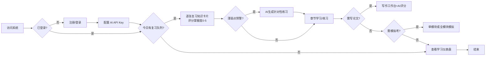
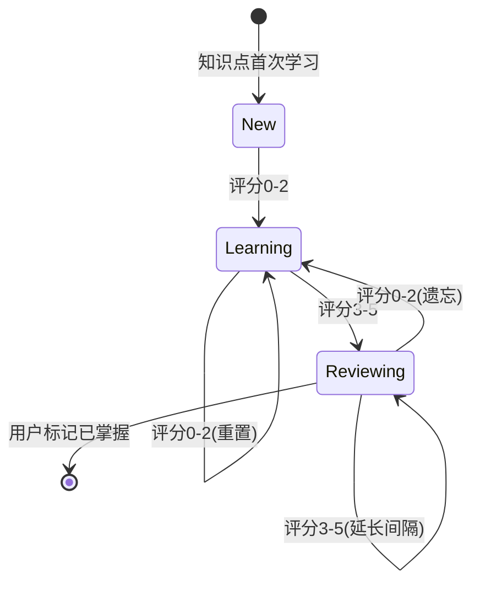
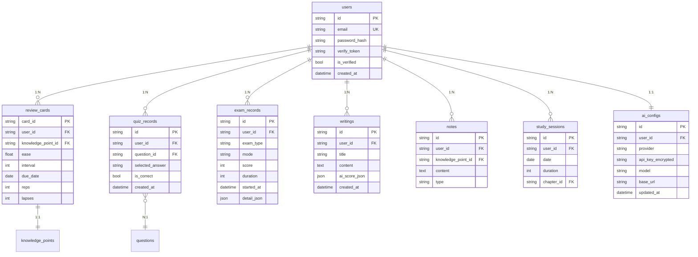

# ArchPrep（系统架构设计师备考系统）PRD v0.2

> 状态：草稿
> 归档日期：—
> 修改记录：执行 `lore log docs/prd/2026-07-08-archprep.md`
> 对应阶段: [TBD - 由 sdd-phase 补全](../phase/2026-07-08-archprep.md)

---

## 0. 目标声明与验收开关（sdd-prd 必填 · 归档触发器）

> **本节是归档触发器**——agent 加载 PRD 时必读。
> 目标达成后，本节验收开关全部勾选，触发归档流程。

### 0.1 目标陈述

> 这份 PRD 是为达成**通过系统架构设计师（软考高级038）考试**而存在。
>
> **目标达成时间窗口**：2026年11月（下半年考试）之前系统可用
> **目标达成的判定**：见下方验收开关

构建一套备考系统，覆盖学习（SM-2 间隔重复）、习题（题库+AI出题）、写作指导（论文AI评分）、模拟考（单/全模块）四大功能。采用 Vercel AI SDK 多模型适配（用户级 API Key），邮件注册制支持跨端同步，本机部署 + cloudflared 开放外网。

### 0.2 业务验收开关

- [ ] 20 章知识点可按教材结构浏览，标记考试权重，支持 AI 答疑
- [ ] SM-2 间隔重复队列连续 7 天正确调度
- [ ] 三种练习模式（章节/随机/错题）正常出题，错题自动收录
- [ ] 薄弱点（正确率<60%）触发 AI 出题，生成题目答案正确率 ≥90%
- [ ] 论文模板 + 10 大高频主题范文齐全
- [ ] AI 论文 5 维度评分（切题30%/应用深度20%/实践性20%/表达15%/综合15%）可用
- [ ] 模拟考支持单模块（单科）和全模块（三科连考）两种模式
- [ ] 案例分析和论文模拟考均有 AI 评分
- [ ] 数据驱动薄弱点推荐合理（基于正确率+模考成绩）
- [ ] 历年真题（2009-2025）可导入
- [ ] 深色模式 + 移动端核心功能可用

### 0.3 技术验收开关

- [ ] vite-plus 全栈（React + Elysia + SQLite）可本地启动运行
- [ ] Vercel AI SDK 多模型适配（OpenAI/Anthropic/智谱GLM），用户级 API Key 配置
- [ ] API Key 加密存储在 SQLite，前端不接触 Key
- [ ] 邮件注册 + JWT 鉴权可用，支持跨端同步
- [ ] cloudflared 隧道可开放外网访问
- [ ] SMTP 邮件服务可发送注册验证邮件
- [ ] 静态数据（知识点 Markdown / 题库 JSON / 范文 MD）Git 维护
- [ ] 用户数据 SQLite 持久化，按 user_id 隔离
- [ ] 页面首屏 <2s，AI 响应 <30s（含超时重试）
- [ ] AI 降级时核心功能（题库练习/知识点浏览/间隔重复）不受影响

### 0.4 归档条件

> 业务验收开关 + 技术验收开关全部勾选 = 可触发归档。

---

## 1. 背景与目标

### 1.1 业务背景

系统架构设计师（软考高级，代码 038）考试自 2023 年上半年起启用第二版官方教材，近 15 年来首次重大改版，旧版资料失效。

| 科目 | 形式 | 时长 | 题量 | 满分 | 合格线 |
|:---|:---|:---|:---|:---|:---|
| 综合知识 | 单选题 | 150 min | 75 题 | 75 | 45 |
| 案例分析 | 5 选 4 主观题 | 90 min | 4 题 | 75 | 45 |
| 论文 | 4 选 1 写作 | 120 min | 1 篇（2000-3000 字） | 75 | 45 |

三科需同时 ≥45 分方可通过。教材分上篇（综合知识 1-11 章）与下篇（案例分析 12-20 章）共 20 章，体量大、知识点分散。论文评分含 5 维度（切题 30%/应用深度 20%/实践性 20%/表达 15%/综合 15%），需结构化训练。

备考痛点：知识点分散无体系、遗忘曲线导致记忆低效、缺乏针对性练习与薄弱点反馈、案例与论文无结构化训练、无法全真模拟。

### 1.2 产品目标

构建备考系统，覆盖学习、习题、写作指导、模拟考四大功能。支持邮件注册与跨端同步，AI 能力通过 Vercel AI SDK 多模型适配，用户自行配置 API Key。

### 1.3 成功指标

- 四大功能模块全部可用，覆盖三科考试全流程
- 间隔重复算法有效辅助知识点记忆（连续 7 天队列正确）
- AI 评分对论文/案例给出可操作的 5 维度反馈
- 数据驱动推荐能识别薄弱章节并生成针对性练习
- 模拟考支持单模块和全模块两种模式
- 注册制支持跨端同步，桌面+移动自适应

---

## 2. 用户与场景

### 2.1 目标用户

| 用户角色 | 描述 | 核心诉求 |
|---------|------|---------|
| 注册用户 | 通过邮件注册的备考者，软件工程背景 | 高效记忆考点、针对性练习、论文结构化训练、全真模拟、跨端同步 |

开放注册，任何人均可注册。用户数据按 user_id 隔离。

### 2.2 使用场景



---

## 3. 功能需求

### 3.1 功能清单

| 功能模块 | 功能点 | 优先级 | 说明 |
|---------|--------|--------|------|
| **用户** | **邮件注册** | **P0** | **邮箱+密码注册，SMTP 发送验证邮件** |
| **用户** | **登录/鉴权** | **P0** | **JWT 鉴权，跨端同步** |
| **用户** | **AI 配置** | **P0** | **用户级 API Key，多模型选择（OpenAI/Anthropic/智谱）** |
| 学习 | 知识点体系管理（20章） | P0 | 按教材结构组织，标记考试权重 |
| 学习 | 间隔重复调度（SM-2） | P0 | 每日复习队列，自动安排下次复习 |
| 学习 | 学习进度追踪 | P1 | 章节完成度、掌握度热力图、连续天数 |
| 学习 | AI 知识点答疑 | P1 | 对话式追问，引用教材章节 |
| 学习 | 知识点重点标注 | P2 | 高亮、笔记、疑问 |
| 习题 | 选择题练习模式 | P0 | 章节/随机/错题三模式 |
| 习题 | 题库管理+真题导入 | P0 | 静态 JSON，支持历年真题导入 |
| 习题 | AI 动态出题 | P1 | 薄弱点正确率<60%触发，生成3-5题 |
| 习题 | 错题本 | P0 | 自动收录，可标记已掌握 |
| 习题 | 练习统计分析 | P0 | 知识点/章节正确率，薄弱点识别 |
| 写作指导 | 论文模板库 | P0 | 摘要+正文四段框架，含字数提示 |
| 写作指导 | 范文库 | P0 | 10大高频主题，含点评 |
| 写作指导 | AI 论文评分 | P0 | 5维度评分+逐段点评+改进建议 |
| 写作指导 | 写作技巧指导 | P1 | 历年题目汇总、选题策略、母版项目 |
| 写作指导 | 论文写作工作台 | P0 | 分节编辑器，实时字数，草稿保存 |
| **模拟考** | **模拟考模式选择** | **P0** | **单模块（单科）/ 全模块（三科连考）** |
| 模拟考 | 综合知识模拟考 | P0 | 75题计时150min，自动评分 |
| 模拟考 | 案例分析模拟考 | P0 | 5选4计时90min，AI评分 |
| 模拟考 | 论文模拟考 | P0 | 4选1计时120min，AI评分 |
| 模拟考 | 成绩记录与趋势 | P1 | 历次记录，分数曲线，合格线对标 |
| 个性化 | 薄弱点识别 | P0 | 正确率<60%或模考得分率<50% |
| 个性化 | 复习推荐 | P1 | 薄弱程度×考试权重，每日推荐 |
| 个性化 | 学习仪表盘 | P0 | 首页聚合复习队列/天数/预警/成绩 |
| 系统 | 主题与响应式 | P0 | 深色/浅色切换，移动自适应 |
| 系统 | 数据持久化 | P0 | SQLite 用户数据，按 user_id 隔离 |
| 系统 | 数据导入导出 | P1 | JSON 备份/恢复 |

### 3.2 详细功能描述

#### 3.2.1 邮件注册与登录（FR-US-01）

**功能说明**：用户通过邮箱注册账号，SMTP 发送验证邮件，JWT 鉴权支持跨端同步。

**输入/前置条件**：
- SMTP 邮件服务已配置
- 用户输入邮箱+密码

**处理逻辑**：
1. 用户提交邮箱+密码
2. 后端校验邮箱格式+密码强度
3. 生成验证 token，SMTP 发送验证邮件
4. 用户点击验证链接激活账号
5. 登录后签发 JWT，前端存储 token
6. 后续请求携带 JWT，后端验证 user_id

**输出/后置条件**：
- 用户账号创建，数据按 user_id 隔离
- JWT 有效期内免登录，跨端同步数据

**异常处理**：
- 邮箱已注册：提示"邮箱已注册"
- 验证邮件发送失败：提示重试
- 密码哈希存储（bcrypt），不明文存储

#### 3.2.2 AI 配置（FR-US-02）

**功能说明**：用户在设置页配置 AI provider、API Key、模型，支持多模型适配。

**输入/前置条件**：
- 用户已登录
- 用户拥有 LLM 服务的 API Key

**处理逻辑**：
1. 用户在设置页选择 provider（OpenAI/Anthropic/智谱GLM/自定义）
2. 输入 API Key
3. 后端加密存储 API Key（AES-256），关联 user_id
4. 可选：配置自定义 base URL（OpenAI 兼容服务）
5. 可选：选择默认模型
6. 提供「测试连接」功能，验证 Key 有效性

**输出/后置条件**：
- API Key 加密存储在 SQLite
- AI 功能（出题/评分/答疑）使用用户配置的 provider
- 前端不接触 API Key

**异常处理**：
- API Key 无效：提示"验证失败，请检查 Key"
- 加密存储失败：提示重试

#### 3.2.3 知识点体系管理（FR-LR-01）

**功能说明**：按官方教材 20 章结构组织知识点，标记考试权重。

**输入/前置条件**：
- 知识点 Markdown 文件已按章节目录组织
- 考试权重标记（高/中/低）已配置

**处理逻辑**：
1. 解析知识点目录结构（篇→章→节→知识点）
2. 渲染树形导航，标记考试权重（高=红/中=黄/低=灰）
3. 点击知识点节点，展示 Markdown 正文

**输出/后置条件**：
- 用户可按章节树形结构浏览全部 20 章知识点
- 权重标记准确反映考试重点

**异常处理**：
- 知识点文件缺失：显示"内容待补充"占位
- Markdown 解析失败：显示原始文本

#### 3.2.4 间隔重复调度 SM-2（FR-LR-02）

**功能说明**：用 SM-2 算法变体管理知识卡片复习。

**输入/前置条件**：
- 知识点已转化为复习卡片（card_id ↔ knowledge_point_id ↔ user_id）
- 卡片初始状态：ease=2.5, interval=1, due_date=今天

**处理逻辑**：
1. 每日生成「今日复习队列」（due_date ≤ 今天的卡片，按到期日排序）
2. 用户复习后评分（0-5）：
   - 0-2（遗忘）：interval=1, ease×=0.8
   - 3（困难）：interval×=1.2
   - 4（良好）：interval×=ease
   - 5（简单）：interval×=ease×=1.3
3. ease 下限 1.3，上限 3.0
4. 更新 due_date = 今天 + interval

**输出/后置条件**：
- 复习队列按 SM-2 算法正确调度
- 遗忘卡片重置间隔为 1 天

**异常处理**：
- 卡片数据损坏：跳过该卡片，记录错误日志

#### 3.2.5 AI 动态出题（FR-QZ-03）

**功能说明**：薄弱知识点触发 AI 生成补充题。

**输入/前置条件**：
- 某知识点练习正确率 < 60%
- 用户已配置 AI API Key

**处理逻辑**：
1. 检测薄弱知识点（正确率 < 60%）
2. 构建 Prompt：知识点教材原文 + 出题要求（四选一、单答案、附解析）
3. 通过 Vercel AI SDK 调用用户配置的 LLM
4. 生成 3-5 道题，标记来源为「AI生成」
5. 用户「采纳/丢弃」后入库

**输出/后置条件**：
- 生成的题目答案正确率 ≥ 90%
- 采纳的题目进入题库

**异常处理**：
- AI 服务超时：提示重试，不影响核心功能
- 用户未配置 API Key：提示"请先在设置中配置 AI"
- 生成题目格式错误：丢弃，记录日志

#### 3.2.6 AI 论文评分（FR-WR-03）

**功能说明**：按官方 5 维度评分论文，通过 Vercel AI SDK 调用用户配置的 LLM。

**输入/前置条件**：
- 用户已提交论文全文（摘要+正文）
- 用户已配置 AI API Key

**处理逻辑**：
1. 构建 Prompt：论文评分标准（5维度+权重）+ 用户论文
2. 通过 Vercel AI SDK 调用用户配置的 LLM
3. 解析返回：各维度得分(0-15) + 总分 + 逐段点评 + 改进建议
4. 检测扣分项：纯理论无项目/跑题/字数不足/无数字量化
5. 支持 streamText 流式输出评分结果

**输出/后置条件**：
- 评分维度齐全（5维度）
- 逐段点评可操作

**异常处理**：
- AI 服务超时：保存草稿，提示稍后重试
- 评分格式异常：降级为总评+总体建议
- 用户未配置 API Key：提示"请先在设置中配置 AI"

#### 3.2.7 模拟考模式选择（FR-EX-00）

**功能说明**：模拟考入口支持单模块（单科）和全模块（三科连考）两种模式。

**输入/前置条件**：
- 题库有足够的题目
- 用户已登录

**处理逻辑**：
1. **单模块模式**：选择一科（综合知识/案例分析/论文），独立计时+评分
2. **全模块模式**：三科连考，模拟真实考试流程（综合知识→案例分析→论文），各科独立计时

**输出/后置条件**：
- 模式选择后进入对应考试界面
- 全模块模式下各科成绩独立记录

#### 3.2.8 综合知识模拟考（FR-EX-01）

**功能说明**：75 题单选，计时 150 min，自动评分。

**输入/前置条件**：
- 题库有 ≥75 道选择题
- 用户启动模拟考

**处理逻辑**：
1. 从题库随机抽取 75 题（真题优先）
2. 启动 150 min 倒计时
3. 用户逐题作答，可跳题/回看
4. 提交后自动评分（对标 45/75 合格线）
5. 生成报告：总分、各章节得分分布、用时统计、错题列表

**输出/后置条件**：
- 成绩记录写入 exam_records（含 user_id）
- 错题自动入错题本

**异常处理**：
- 计时到期自动提交

#### 3.2.9 案例分析模拟考（FR-EX-02）

**功能说明**：5 选 4 主观题，计时 90 min，AI 评分。

**输入/前置条件**：
- 案例题库已加载
- 用户已配置 AI API Key（未配置则仅对照参考答案）

**处理逻辑**：
1. 展示 5 道案例题，用户选答 4 道
2. 启动 90 min 倒计时
3. 文本输入作答 + 简易画图（Mermaid 文字描述）
4. 提交后 AI 评分（通过 Vercel AI SDK）：
   - 按采分点评分：架构风格选择/质量属性分析/设计模式识别/性能计算
   - 输出：各题得分 + 要点覆盖度 + 改进建议
5. 未配置 AI Key 时：对照参考答案，用户自评

**输出/后置条件**：
- AI 评分能识别关键采分点
- 成绩记录写入 exam_records

### 3.3 业务规则显性化

复习卡片状态机：



---

## 4. 非功能需求

### 4.1 性能要求

- 响应时间：页面首屏 < 2s
- AI 响应：< 30s（含超时重试，最多 3 次）
- 数据处理：题库 ≤500 题秒级加载

### 4.2 安全要求

- 认证方式：JWT 鉴权，邮件注册
- 权限控制：用户数据按 user_id 隔离
- API Key 加密：AES-256 加密存储在 SQLite
- 密码存储：bcrypt 哈希
- **数据分级**：API Key 为敏感数据，加密存储；学习数据为用户私有

### 4.3 可用性要求

- 可用性目标：本机部署 + cloudflared 隧道
- 备份策略：用户数据可导出 JSON
- **AI 降级**：AI 不可用时核心功能（题库练习/知识点浏览/间隔重复）不受影响

### 4.4 约束归入

#### P0 约束（不做就阻塞）

| 卡点 | 约束 | 理由 |
|------|------|------|
| AI SDK | **必须**：Vercel AI SDK 多模型适配；**禁止**：自建 LLM 代理 | SDK 集成方案适配，用户级 API Key |
| API Key 存储 | **必须**：AES-256 加密存 SQLite；**禁止**：明文存储或前端暴露 | 安全 |
| 鉴权 | **必须**：JWT + 邮件注册；**禁止**：无鉴权或 session | 跨端同步 + 公网访问安全 |
| 数据隔离 | **必须**：所有用户数据按 user_id 隔离；**禁止**：全局共享 | 多用户数据安全 |
| 数据库 | **必须**：SQLite WAL 模式；**禁止**：PostgreSQL | 本机部署轻量 |
| 邮件服务 | **必须**：SMTP 自建；**禁止**：依赖第三方 API | 自主可控 |
| 部署 | **必须**：本机 + cloudflared 隧道；**禁止**：云服务器 | 无需公网 IP，轻量部署 |
| 知识点格式 | **必须**：Markdown；**禁止**：富文本 HTML | Git 可维护 + 可 diff |
| 题库格式 | **必须**：JSON 静态文件；**禁止**：数据库存题目 | Git 维护 + 可 diff |
| 间隔重复 | **必须**：SM-2 变体；**禁止**：简单随机复习 | 科学记忆算法 |

#### P1 约束（早期做）

| 卡点 | 约束 | 理由 |
|------|------|------|
| 前端管理 | **必须**：`vp` 命令；**禁止**：npm/pnpm/yarn | frontend-use-vp 规则 |
| 提交协议 | **必须**：`lore commit`；**禁止**：`git commit` | lore 协议 |
| 错误码 | **必须**：`DOMAIN_CODE` 格式 | 统一错误处理 |
| AI 模块结构 | **参考 open-pencil/chat 结构**：providers/storage/transports/prompts | 成熟架构参考 |

---

## 5. 验收标准

### 5.1 功能验收

- [ ] 邮件注册+登录可用，JWT 鉴权正常
- [ ] AI 配置页可配置多模型，API Key 加密存储
- [ ] 20章知识点可浏览，考试权重标记准确
- [ ] SM-2 复习队列连续 7 天正确调度
- [ ] 三种练习模式正常出题，错题自动收录
- [ ] 薄弱点触发 AI 出题，生成题目正确率 ≥90%
- [ ] 论文模板+10大主题范文齐全
- [ ] AI 论文 5 维度评分可用
- [ ] 模拟考支持单模块和全模块两种模式
- [ ] 案例分析和论文模拟考有 AI 评分
- [ ] 数据驱动薄弱点推荐合理

### 5.2 非功能验收

- [ ] 页面首屏 <2s
- [ ] AI 响应 <30s
- [ ] AI 降级时核心功能不受影响
- [ ] API Key 加密存储，前端不接触
- [ ] 用户数据按 user_id 隔离
- [ ] cloudflared 隧道可外网访问
- [ ] SMTP 邮件可发送

---

## 6. 数据需求

### 6.1 数据模型



### 6.2 静态数据

| 数据集 | 格式 | 内容 | 来源 |
|:---|:---|:---|:---|
| 知识点库 | Markdown | 20 章知识点正文 | 基于官方教材第2版编写 |
| 选择题库 | JSON | 题干/选项/答案/解析/章节/难度/来源 | 调研报告60题扩展 + 真题导入 |
| 案例题库 | JSON | 题干/参考答案/采分点 | 调研报告五大方向扩展 |
| 论文范文 | Markdown | 10大主题范文 | 自编 + 参考 |
| 论文模板 | JSON | 结构模板 | 调研报告4.3节 |

---

## 7. 界面需求

### 7.1 页面结构

```
注册/登录（公开）
├── 首页（学习仪表盘）
├── 学习
│   ├── 知识点浏览（章节树）
│   ├── 今日复习队列
│   └── AI 答疑
├── 习题
│   ├── 练习模式选择
│   ├── 答题界面
│   ├── 错题本
│   └── 统计分析
├── 写作指导
│   ├── 模板/范文浏览
│   ├── 写作工作台
│   └── AI 评分结果
├── 模拟考
│   ├── 模式选择（单模块/全模块）
│   ├── 考试界面
│   └── 成绩报告
└── 设置
    ├── AI 配置（provider/Key/model）
    ├── 个人信息
    └── 数据导入导出
```

### 7.2 关键页面

- **注册/登录页**：邮箱+密码表单，注册时发送验证邮件
- **首页仪表盘**：今日复习队列 + 连续天数 + 薄弱点预警 + 上次模考成绩
- **AI 配置页**：provider 下拉选择 + API Key 输入 + 模型选择 + 连接测试按钮
- **模拟考模式选择**：单模块（3选1）/ 全模块（三科连考）选项卡
- **答题界面**：题干 + 选项 + 提交后解析
- **写作工作台**：分节编辑器 + 实时字数 + AI评分按钮
- **考试界面**：题号导航 + 倒计时 + 答题卡

---

## 8. 集成需求

### 8.1 外部系统集成

| 系统 | 集成方式 | 数据流向 | 说明 |
|---------|---------|---------|------|
| Vercel AI SDK | 后端 Elysia 集成 | 双向 | 多模型适配（OpenAI/Anthropic/智谱） |
| 智谱 GLM | OpenAI 兼容模式 | 单向 | base URL: open.bigmodel.cn/api/paas/v4/ |
| SMTP 邮件 | 后端 nodemailer | 单向 | 注册验证邮件 |
| cloudflared | 隧道代理 | 双向 | 本机服务暴露外网 |
| GitHub 真题 | 手动导入 JSON | 单向 | 2009-2025 真题 |

---

## 9. 风险与约束

### 9.1 已知风险

| 风险 | 影响 | 概率 | 应对措施 |
|------|------|------|---------|
| LLM API 不稳定 | 高 | 中 | 超时重试 + 功能降级 |
| AI 评分不准 | 中 | 中 | 用历年范文校准 |
| 真题版权问题 | 中 | 低 | 确认开源协议，自建兜底 |
| SM-2 参数不适配 | 低 | 中 | 上线后 2 周调参 |
| SQLite 并发写入 | 中 | 低 | WAL 模式 + 写入重试 |
| cloudflared 隧道不稳定 | 中 | 低 | 重连机制 |

### 9.2 假设清单

| 假设 | 若不成立 → 影响 | 兜底方案 |
|------|----------------|----------|
| LLM API 稳定可用 | AI 功能不可用 | 核心功能降级（题库/知识点/间隔重复） |
| AI 评分对齐阅卷标准 | 评分仅供参考 | 人工校准 + 参考答案对照 |
| GitHub 真题可合规使用 | 无法导入真题 | 自建题库扩展 |
| SMTP 邮件可达 | 注册流程受阻 | 手动激活兜底 |

### 9.3 约束条件

- 技术栈：vite-plus 全栈（React + Elysia + SQLite）
- AI：Vercel AI SDK 多模型适配（用户级 API Key）
- 部署：本机 + cloudflared 隧道
- 邮件：SMTP 自建
- 前端管理：`vp` 命令
- 提交协议：`lore commit`

---

## 10. 上线计划

### 10.1 上线时间

- 计划可用日期：2026 年 8 月（备考 11 月下半年考试）
- 本机部署 + cloudflared 隧道开放外网

### 10.2 上线前准备

- [ ] 知识点 20 章内容编写完成
- [ ] 题库 ≥200 题（含真题导入）
- [ ] AI Prompt 调优完成（出题/评分/答疑）
- [ ] SMTP 邮件服务配置完成
- [ ] cloudflared 隧道配置完成
- [ ] SM-2 参数校准

---

## 11. 附录

### 11.1 ADR 引用

- 决策：用 vite-plus 全栈而非纯前端 SPA（待 ADR-001）
- 决策：用 SM-2 间隔重复而非顺序学习（待 ADR-002）
- 决策：用静态文件而非数据库存题库（待 ADR-003）
- 决策：用 Vercel AI SDK 多模型适配而非自建 LLM 代理（待 ADR-004）
- 决策：用邮件注册+JWT 而非无鉴权（待 ADR-005）
- 决策：用本机+cloudflared 而非云服务器（待 ADR-006）
- 完整 ADR 集 → `docs/architecture/decisions.md`

### 11.2 参考资料

- [调研报告.md](../reference/调研报告.md) — 考试信息、教材20章、题库、论文指导原始素材
- [官方教材] 《系统架构设计师教程（第2版）》（清华，2022.11，ISBN 9787302619925）
- [考试大纲] 2022年审定通过
- [GitHub 真题] `xxlllq/system_architect`、`xiaomabenten/system_architect`
- [Vercel AI SDK] https://ai-sdk.dev/docs/ai-sdk-core/provider-management
- [智谱 GLM 兼容接口] https://docs.bigmodel.cn/cn/guide/platform/model-migration
- [AI 架构参考] open-pencil/open-pencil `src/app/ai/chat/`（provider-models/storage/transports 结构）
- [sdd-core 规范] → sdd-core/references/conventions.md

### 11.3 术语表

| 术语 | 定义 |
|------|------|
| SM-2 | SuperMemo 2 间隔重复算法，根据掌握度调度复习时间 |
| ArchPrep | Architecture Exam Prep，本项目代号 |
| 软考高级038 | 系统架构设计师考试代码 |
| Vercel AI SDK | 多模型统一抽象层 SDK，支持 OpenAI/Anthropic/智谱等 |
| cloudflared | Cloudflare Tunnel，将本机服务暴露到公网 |
| JWT | JSON Web Token，无状态鉴权方案 |
| WAL | Write-Ahead Logging，SQLite 并发优化模式 |
