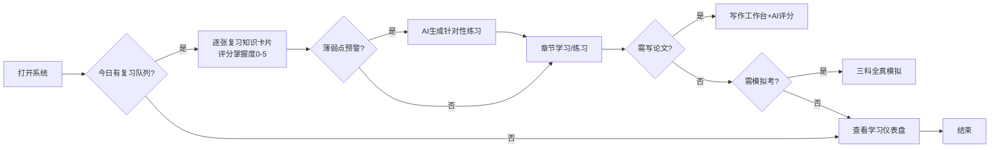
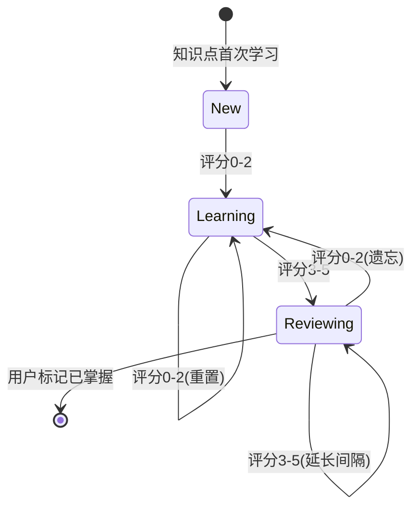
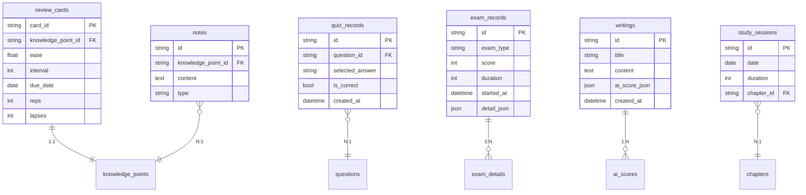

# ArchPrep（系统架构设计师备考系统）PRD v0.1

> 状态：草稿
> 归档日期：—
> 修改记录：执行 `lore log docs/prd/2026-07-08-archprep.md`
> 对应阶段: [TBD - 由 sdd-phase 补全](../phase/2026-07-08-archprep.md)

---

## 0. 目标声明与验收开关（sdd-prd 必填 · 归档触发器）

> **本节是归档触发器**——agent 加载 PRD 时必读。
> 目标达成后，本节验收开关全部勾选，触发归档流程。

### 0.1 目标陈述

> 这份 PRD 是为达成**通过系统架构设计师（软考高级038）考试**而存在。
>
> **目标达成时间窗口**：2026年11月（下半年考试）之前系统可用
> **目标达成的判定**：见下方验收开关

构建一套专为个人使用的备考系统，覆盖学习（SM-2 间隔重复）、习题（题库+AI出题）、写作指导（论文AI评分）、模拟考（三科全模拟）四大功能，以考试重点为深度导向，兼顾知识全面性。

### 0.2 业务验收开关

- [ ] 20 章知识点可按教材结构浏览，标记考试权重，支持 AI 答疑
- [ ] SM-2 间隔重复队列连续 7 天正确调度
- [ ] 三种练习模式（章节/随机/错题）正常出题，错题自动收录
- [ ] 薄弱点（正确率<60%）触发 AI 出题，生成题目答案正确率 ≥90%
- [ ] 论文模板 + 10 大高频主题范文齐全
- [ ] AI 论文 5 维度评分（切题30%/应用深度20%/实践性20%/表达15%/综合15%）可用
- [ ] 三科模拟考计时+评分正常，成绩记录持久化
- [ ] 数据驱动薄弱点推荐合理（基于正确率+模考成绩）
- [ ] 历年真题（2009-2025）可导入
- [ ] 深色模式 + 移动端核心功能可用

### 0.3 技术验收开关

- [ ] vite-plus 全栈（React + Elysia + SQLite）可本地启动运行
- [ ] AI 服务层后端代理 LLM API，前端不直接调用
- [ ] 静态数据（知识点 Markdown / 题库 JSON / 范文 MD）Git 维护
- [ ] 用户数据 SQLite 持久化，重启不丢失
- [ ] 页面首屏 <2s，AI 响应 <30s（含超时重试）
- [ ] AI 降级时核心功能（题库练习/知识点浏览）不受影响

### 0.4 归档条件

> 业务验收开关 + 技术验收开关全部勾选 = 可触发归档。

---

## 1. 背景与目标

### 1.1 业务背景

系统架构设计师（软考高级，代码 038）考试自 2023 年上半年起启用第二版官方教材，近 15 年来首次重大改版，旧版资料失效。

| 科目 | 形式 | 时长 | 题量 | 满分 | 合格线 |
|:---|:---|:---|:---|:---|:---|
| 综合知识 | 单选题 | 150 min | 75 题 | 75 | 45 |
| 案例分析 | 5 选 4 主观题 | 90 min | 4 题 | 75 | 45 |
| 论文 | 4 选 1 写作 | 120 min | 1 篇（2000-3000 字） | 75 | 45 |

三科需同时 ≥45 分方可通过。教材分上篇（综合知识 1-11 章）与下篇（案例分析 12-20 章）共 20 章，体量大、知识点分散。论文评分含 5 维度（切题 30%/应用深度 20%/实践性 20%/表达 15%/综合 15%），需结构化训练。

备考痛点：知识点分散无体系、遗忘曲线导致记忆低效、缺乏针对性练习与薄弱点反馈、案例与论文无结构化训练、无法全真模拟。

### 1.2 产品目标

构建专为个人使用的线上备考系统，覆盖学习、习题、写作指导、模拟考四大功能，以考试重点为学习深度导向，兼顾知识全面性。

### 1.3 成功指标

- 四大功能模块全部可用，覆盖三科考试全流程
- 间隔重复算法有效辅助知识点记忆（连续 7 天队列正确）
- AI 评分对论文/案例给出可操作的 5 维度反馈
- 数据驱动推荐能识别薄弱章节并生成针对性练习
- 桌面+移动自适应，可随时随地复习

---

## 2. 用户与场景

### 2.1 目标用户

| 用户角色 | 描述 | 核心诉求 |
|---------|------|---------|
| 备考者（本人） | 系统架构设计师考生，软件工程背景 | 高效记忆考点、针对性练习、论文结构化训练、全真模拟 |

单一用户，无需鉴权。系统数据归属该用户一人。

### 2.2 使用场景



---

## 3. 功能需求

### 3.1 功能清单

| 功能模块 | 功能点 | 优先级 | 说明 |
|---------|--------|--------|------|
| 学习 | 知识点体系管理（20章） | P0 | 按教材结构组织，标记考试权重 |
| 学习 | 间隔重复调度（SM-2） | P0 | 每日复习队列，自动安排下次复习 |
| 学习 | 学习进度追踪 | P1 | 章节完成度、掌握度热力图、连续天数 |
| 学习 | AI 知识点答疑 | P1 | 对话式追问，引用教材章节 |
| 学习 | 知识点重点标注 | P2 | 高亮、笔记、疑问 |
| 习题 | 选择题练习模式 | P0 | 章节/随机/错题三模式 |
| 习题 | 题库管理+真题导入 | P0 | 静态 JSON，支持历年真题导入 |
| 习题 | AI 动态出题 | P1 | 薄弱点正确率<60%触发，生成3-5题 |
| 习题 | 错题本 | P0 | 自动收录，可标记已掌握 |
| 习题 | 练习统计分析 | P0 | 知识点/章节正确率，薄弱点识别 |
| 写作指导 | 论文模板库 | P0 | 摘要+正文四段框架，含字数提示 |
| 写作指导 | 范文库 | P0 | 10大高频主题，含点评 |
| 写作指导 | AI 论文评分 | P0 | 5维度评分+逐段点评+改进建议 |
| 写作指导 | 写作技巧指导 | P1 | 历年题目汇总、选题策略、母版项目 |
| 写作指导 | 论文写作工作台 | P0 | 分节编辑器，实时字数，草稿保存 |
| 模拟考 | 综合知识模拟考 | P0 | 75题计时150min，自动评分 |
| 模拟考 | 案例分析模拟考 | P0 | 5选4计时90min，AI评分 |
| 模拟考 | 论文模拟考 | P0 | 4选1计时120min，AI评分 |
| 模拟考 | 成绩记录与趋势 | P1 | 历次记录，分数曲线，合格线对标 |
| 个性化 | 薄弱点识别 | P0 | 正确率<60%或模考得分率<50% |
| 个性化 | 复习推荐 | P1 | 薄弱程度×考试权重，每日推荐 |
| 个性化 | 学习仪表盘 | P0 | 首页聚合复习队列/天数/预警/成绩 |
| 系统 | 主题与响应式 | P0 | 深色/浅色切换，移动自适应 |
| 系统 | 数据持久化 | P0 | SQLite 用户数据 |
| 系统 | 数据导入导出 | P1 | JSON 备份/恢复 |

### 3.2 详细功能描述

#### 3.2.1 知识点体系管理（FR-LR-01）

**功能说明**：按官方教材 20 章结构组织知识点，标记考试权重。

**输入/前置条件**：
- 知识点 Markdown 文件已按章节目录组织
- 考试权重标记（高/中/低）已配置

**处理逻辑**：
1. 解析知识点目录结构（篇→章→节→知识点）
2. 渲染树形导航，标记考试权重（高=红/中=黄/低=灰）
3. 点击知识点节点，展示 Markdown 正文

**输出/后置条件**：
- 用户可按章节树形结构浏览全部 20 章知识点
- 权重标记准确反映考试重点

**异常处理**：
- 知识点文件缺失：显示"内容待补充"占位
- Markdown 解析失败：显示原始文本

#### 3.2.2 间隔重复调度 SM-2（FR-LR-02）

**功能说明**：用 SM-2 算法变体管理知识卡片复习。

**输入/前置条件**：
- 知识点已转化为复习卡片（card_id ↔ knowledge_point_id）
- 卡片初始状态：ease=2.5, interval=1, due_date=今天

**处理逻辑**：
1. 每日生成「今日复习队列」（due_date ≤ 今天的卡片，按到期日排序）
2. 用户复习后评分（0-5）：
   - 0-2（遗忘）：interval=1, ease×=0.8
   - 3（困难）：interval×=1.2
   - 4（良好）：interval×=ease
   - 5（简单）：interval×=ease×=1.3
3. ease 下限 1.3，上限 3.0
4. 更新 due_date = 今天 + interval

**输出/后置条件**：
- 复习队列按 SM-2 算法正确调度
- 遗忘卡片重置间隔为 1 天

**异常处理**：
- 卡片数据损坏：跳过该卡片，记录错误日志

#### 3.2.3 选择题练习（FR-QZ-01）

**功能说明**：三模式选择题练习（章节/随机/错题重练）。

**输入/前置条件**：
- 题库 JSON 已加载
- 用户选择练习模式

**处理逻辑**：
1. **章节练习**：按选定章节顺序/随机出题
2. **随机出题**：跨章节随机抽取（10/20/50 题可选）
3. **错题重练**：从错题本抽取
4. 每题展示题干+选项，提交后显示答案+解析+教材章节定位

**输出/后置条件**：
- 做错的题自动入错题本
- 练习记录写入 quiz_records

**异常处理**：
- 题库为空：提示"请先导入题库"

#### 3.2.4 AI 动态出题（FR-QZ-03）

**功能说明**：薄弱知识点触发 AI 生成补充题。

**输入/前置条件**：
- 某知识点练习正确率 < 60%
- AI 服务可用

**处理逻辑**：
1. 检测薄弱知识点（正确率 < 60%）
2. 构建 Prompt：知识点教材原文 + 出题要求（四选一、单答案、附解析）
3. 调用 LLM API 生成 3-5 道题
4. 生成题目标记来源为「AI生成」
5. 用户「采纳/丢弃」后入库

**输出/后置条件**：
- 生成的题目答案正确率 ≥ 90%
- 采纳的题目进入题库

**异常处理**：
- AI 服务超时：提示重试，不影响核心功能
- 生成题目格式错误：丢弃，记录日志

#### 3.2.5 AI 论文评分（FR-WR-03）

**功能说明**：按官方 5 维度评分论文。

**输入/前置条件**：
- 用户已提交论文全文（摘要+正文）
- AI 服务可用

**处理逻辑**：
1. 构建 Prompt：论文评分标准（5维度+权重）+ 用户论文
2. 调用 LLM API
3. 解析返回：各维度得分(0-15) + 总分 + 逐段点评 + 改进建议
4. 检测扣分项：纯理论无项目/跑题/字数不足/无数字量化

**输出/后置条件**：
- 评分维度齐全（5维度）
- 逐段点评可操作

**异常处理**：
- AI 服务超时：保存草稿，提示稍后重试
- 评分格式异常：降级为总评+总体建议

#### 3.2.6 综合知识模拟考（FR-EX-01）

**功能说明**：75 题单选，计时 150 min，自动评分。

**输入/前置条件**：
- 题库有 ≥75 道选择题
- 用户启动模拟考

**处理逻辑**：
1. 从题库随机抽取 75 题（真题优先）
2. 启动 150 min 倒计时
3. 用户逐题作答，可跳题/回看
4. 提交后自动评分（对标 45/75 合格线）
5. 生成报告：总分、各章节得分分布、用时统计、错题列表

**输出/后置条件**：
- 成绩记录写入 exam_records
- 错题自动入错题本

**异常处理**：
- 计时到期自动提交

### 3.3 业务规则显性化

复习卡片状态机：



---

## 4. 非功能需求

### 4.1 性能要求

- 响应时间：页面首屏 < 2s
- AI 响应：< 30s（含超时重试，最多 3 次）
- 数据处理：题库 ≤500 题秒级加载

### 4.2 安全要求

- 认证方式：无（个人单用户）
- 权限控制：无
- 数据加密：AI 请求不携带个人信息
- **数据分级**：无敏感数据，用户数据本地 SQLite

### 4.3 可用性要求

- 可用性目标：本地部署，无 SLA
- 备份策略：用户数据可导出 JSON
- **AI 降级**：AI 不可用时核心功能（题库练习/知识点浏览/间隔重复）不受影响

### 4.4 约束归入

#### P0 约束（不做就阻塞）

| 卡点 | 约束 | 理由 |
|------|------|------|
| AI 代理 | **必须**：后端代理 LLM API；**禁止**：前端直接调用 | 安全 + Prompt 集中管理 |
| 数据存储 | **必须**：SQLite 用户数据；**禁止**：localStorage 存关键数据 | 持久化 + 可查询 |
| 知识点格式 | **必须**：Markdown；**禁止**：富文本 HTML | Git 可维护 + 可 diff |
| 题库格式 | **必须**：JSON 静态文件；**禁止**：数据库存题目 | Git 维护 + 可 diff |
| 间隔重复 | **必须**：SM-2 变体；**禁止**：简单随机复习 | 科学记忆算法 |

#### P1 约束（早期做）

| 卡点 | 约束 | 理由 |
|------|------|------|
| 前端管理 | **必须**：`vp` 命令；**禁止**：npm/pnpm/yarn | frontend-use-vp 规则 |
| 提交协议 | **必须**：`lore commit`；**禁止**：`git commit` | lore 协议 |
| 错误码 | **必须**：`DOMAIN_CODE` 格式 | 统一错误处理 |

---

## 5. 验收标准

### 5.1 功能验收

- [ ] 20章知识点可浏览，考试权重标记准确
- [ ] SM-2 复习队列连续 7 天正确调度
- [ ] 三种练习模式正常出题，错题自动收录
- [ ] 薄弱点触发 AI 出题，生成题目正确率 ≥90%
- [ ] 论文模板+10大主题范文齐全
- [ ] AI 论文 5 维度评分可用
- [ ] 三科模拟考计时+评分正常
- [ ] 数据驱动薄弱点推荐合理

### 5.2 非功能验收

- [ ] 页面首屏 <2s
- [ ] AI 响应 <30s
- [ ] AI 降级时核心功能不受影响
- [ ] 数据重启不丢失
- [ ] 移动端核心功能可用

### 5.3 业务规则验收

- [ ] 复习卡片状态机各状态可正常流转
- [ ] 薄弱点识别（正确率<60%）准确触发

---

## 6. 数据需求

### 6.1 数据模型



### 6.2 静态数据

| 数据集 | 格式 | 内容 | 来源 |
|:---|:---|:---|:---|
| 知识点库 | Markdown | 20 章知识点正文 | 基于官方教材第2版编写 |
| 选择题库 | JSON | 题干/选项/答案/解析/章节/难度/来源 | 调研报告60题扩展 + 真题导入 |
| 案例题库 | JSON | 题干/参考答案/采分点 | 调研报告五大方向扩展 |
| 论文范文 | Markdown | 10大主题范文 | 自编 + 参考 |
| 论文模板 | JSON | 结构模板 | 调研报告4.3节 |

---

## 7. 界面需求

### 7.1 页面结构

```
首页（学习仪表盘）
├── 学习
│   ├── 知识点浏览（章节树）
│   ├── 今日复习队列
│   └── AI 答疑
├── 习题
│   ├── 练习模式选择
│   ├── 答题界面
│   ├── 错题本
│   └── 统计分析
├── 写作指导
│   ├── 模板/范文浏览
│   ├── 写作工作台
│   └── AI 评分结果
└── 模拟考
    ├── 科目选择
    ├── 考试界面
    └── 成绩报告
```

### 7.2 关键页面

- **首页仪表盘**：今日复习队列 + 连续天数 + 薄弱点预警 + 上次模考成绩
- **答题界面**：题干 + 选项 + 提交后解析（折叠/展开）
- **写作工作台**：分节编辑器（摘要/背景/方案/效果/结论）+ 实时字数 + AI评分按钮
- **考试界面**：题号导航 + 倒计时 + 答题卡

---

## 8. 集成需求

### 8.1 外部系统集成

| 系统 | 集成方式 | 数据流向 | 说明 |
|---------|---------|---------|------|
| LLM API | 后端 HTTP 代理 | 双向 | 出题/评分/答疑/路径推荐 |
| GitHub 真题 | 手动导入 JSON | 单向 | 2009-2025 真题 |

---

## 9. 风险与约束

### 9.1 已知风险

| 风险 | 影响 | 概率 | 应对措施 |
|------|------|------|---------|
| LLM API 不稳定 | 高 | 中 | 超时重试 + 功能降级 |
| AI 评分不准 | 中 | 中 | 用历年范文校准 |
| 真题版权问题 | 中 | 低 | 确认开源协议，自建兜底 |
| SM-2 参数不适配 | 低 | 中 | 上线后 2 周调参 |

### 9.2 假设清单

| 假设 | 若不成立 → 影响 | 兜底方案 |
|------|----------------|----------|
| LLM API 稳定可用 | AI 功能不可用 | 核心功能降级（题库/知识点/间隔重复） |
| AI 评分对齐阅卷标准 | 评分仅供参考 | 人工校准 + 参考答案对照 |
| GitHub 真题可合规使用 | 无法导入真题 | 自建题库扩展 |

### 9.3 约束条件

- 技术栈：vite-plus 全栈（React + Elysia + SQLite）
- 前端管理：`vp` 命令
- 提交协议：`lore commit`
- 个人单用户，无鉴权

---

## 10. 上线计划

### 10.1 上线时间

- 计划可用日期：2026 年 8 月（备考 11 月下半年考试）
- 无灰度，个人本地部署

### 10.2 上线前准备

- [ ] 知识点 20 章内容编写完成
- [ ] 题库 ≥200 题（含真题导入）
- [ ] AI Prompt 调优完成
- [ ] SM-2 参数校准

---

## 11. 附录

### 11.1 ADR 引用

- 决策：用 vite-plus 全栈而非纯前端 SPA（待 ADR-001）
- 决策：用 SM-2 间隔重复而非顺序学习（待 ADR-002）
- 决策：用静态文件而非数据库存题库（待 ADR-003）
- 完整 ADR 集 → `docs/architecture/decisions.md`

### 11.2 参考资料

- [调研报告.md](../../调研报告.md) — 考试信息、教材20章、题库、论文指导原始素材
- [官方教材] 《系统架构设计师教程（第2版）》（清华，2022.11，ISBN 9787302619925）
- [考试大纲] 2022年审定通过
- [GitHub 真题] `xxlllq/system_architect`、`xiaomabenten/system_architect`
- [sdd-core 规范] → sdd-core/references/conventions.md
- [sdd-core 模板] → sdd-core/references/templates.md §1

### 11.3 术语表

| 术语 | 定义 |
|------|------|
| SM-2 | SuperMemo 2 间隔重复算法，根据掌握度调度复习时间 |
| ArchPrep | Architecture Exam Prep，本项目代号 |
| 软考高级038 | 系统架构设计师考试代码 |
| ATAM | Architecture Tradeoff Analysis Method，架构权衡分析法 |
| 间隔重复 | 根据遗忘曲线，在即将遗忘前安排复习的记忆方法 |
