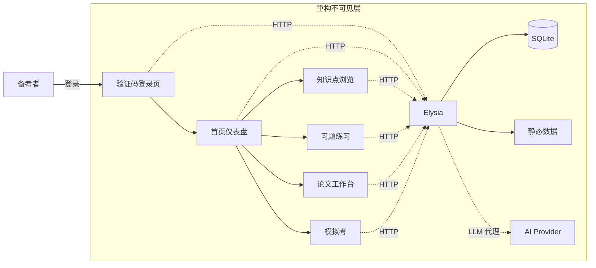

# ArchPrep 前端栈重构：antd 6 → Base UI + Tailwind v4（PRD）

> 状态：草稿
> 归档日期：-
> 修改记录：执行 `lore log docs/prd/2026-07-09-frontend-refactor-to-base-ui.md`
> 对应阶段: [Phase F: 前端栈重构](../phase/2026-07-09-frontend-refactor.md)（已建立，路径: `../phase/2026-07-09-frontend-refactor.md`）
> 上游 PRD: [ArchPrep PRD v0.4](2026-07-08-archprep.md) — 本文件只补充前端栈替换，不修改原有 35 项 FR

---

## 0. 目标声明与验收开关（sdd-prd 必填 · 归档触发器）

> **本节是归档触发器**——agent 加载本 PRD 时必读。
> 目标达成后，本节验收开关全部勾选，触发归档流程。

### 0.1 目标陈述

> 这份 PRD 是为达成**将 ArchPrep 前端 SPA 的 UI 库从 antd 6 全量替换为 Base UI + Tailwind v4 + CVA，并接入 TanStack Router/Query、zustand、Eden Treaty 主路径，以保留所有 35 项业务功能的前提下消除"古老写法 + 重组件"问题**而存在。

**背景**：截至 2026-07-09，仓库 `apps/admin` 仍以 antd 6.5 为唯一 UI 库；典型页面（`ProgressPage.tsx` 701 行 / `KnowledgePage.tsx` 688 行 / `EssayExamPage.tsx` 622 行）以 `useEffect + useState + 手写 type guard` 的旧式写法组织数据层；Eden Treaty 客户端（`api/eden.ts`）已接入但零调用；同时与 2026-11 下半年软考备考时间窗并行。

**目标达成时间窗口**：2026-09-15 之前 Phase F 必须进入稳定可演示状态（保留 6 周冲刺）。

**目标达成的判定**：见下方验收开关 §0.2、§0.3。

### 0.2 业务验收开关

> 与上游业务功能**完全等价**：替换 UI 库不应改变任何受用户感知的业务行为（数据 API、字段、流程一致）。

- [ ] 原 PRD `2026-07-08-archprep.md` §5.1 「功能验收」 27 条全部仍可通过（关键样本 + 自动化回归覆盖）
- [ ] 替代前后同一用户在相同 seed 数据下的关键交互截图差异 ≤ 可接受阈值（由 Phase F 任务定义）
- [ ] 24 个旧 page 入口全部有等价新入口（URL 路径、面包屑、最终用户可达路径一致；其中登录、`/learn/:chapterId/:kpId/qa`、模拟考暂停/继续三类高风险路径 100% 等价）
- [ ] Markdown 渲染的节点结构（`MarkdownRenderer.tsx` 的 `h1/h2/h3/p/ul/ol/li/table/pre/code/blockquote/a/strong/hr/sup/footnotesSection` 等 14 类选择器）与上游视觉一致或更优
- [ ] 学习仪表盘、统计页面、复习页面的图表与 antd `Card/Statistic/Progress/Tag` 视觉近似（不要求像素一致；颜色变量对应规则一致）

### 0.3 技术验收开关

- [ ] `grep -rE "from ['\"]antd['\"]" apps/admin/src` 命中 **0 行**（antd 6 完全移除）
- [ ] `grep -rE "from ['\"]@ant-design/icons['\"]" apps/admin/src` 命中 **0 行**
- [ ] `@tanstack/react-router` 走文件式路由（`routes/__root.tsx` + `routes/_authenticated/route.tsx` + 9 个 `features/<x>/` 切片路由）；App.tsx 的 21 条手写 `<Route>` 全数移除
- [ ] `@tanstack/react-query` 接管 24 个原 page 中已识别的全部 `useEffect + fetch + cancelled` 模式（最低门槛：HomePage/StatsPage/QuizPage 3 个最痛页面先行迁移，且 v0 阶段全仓库无新增裸 `useEffect fetch`）
- [ ] zustand 替代 `apps/admin/src/store/theme.ts` 自写订阅者 Set（迁后该文件 ≤ 30 行）
- [ ] Eden Treaty（`api/eden.ts`）成为业务数据主调用入口；`api/client.ts` 仅保 `sendCode/verifyCode/login` 兼容 shim，Phase F 末尾删除
- [ ] Tailwind v4 启用：`apps/admin/src/styles/{index,theme,theme-presets}.css` 含 `:root`/`.dark` CSS 变量 + `@theme inline`；无 `tailwind.config.js`
- [ ] Base UI 1.x + CVA 提供 ≥ 12 个基础组件（Button/Card/Input/Textarea/Select/Dialog/Drawer/Tooltip/Toast/Dropdown/Avatar/Skeleton）
- [ ] 测试：`vitest` 与 `jsdom` polyfill 已配齐；至少 3 个新增 hook/store/query 用例通过；旧 page 删除前 1:1 迁移测试覆盖
- [ ] 文档：`docs/architecture/overview.md` §3.2 技术栈表格同步更新；`docs/index.md` 索引同步；本 PRD §0.2/§0.3 全勾后归档归档

### 0.4 归档条件

> 业务验收开关 + 技术验收开关全部勾选 = 可触发归档，归档时须把 `docs/phase/2026-07-09-frontend-refactor.md` §6「依赖关系」补完整，并完成 `docs/index.md` 表更新。

---

## 1. 背景与目标

### 1.1 业务背景

截至 2026-07-09，`apps/admin` 共 38 个 `.ts/.tsx` 源文件，24 个 monolith 页面共 8485 行，单页最大 701 行（`ProgressPage.tsx`）。业务功能 100% 可用，技术栈形式新（React 19、antd 6、Eden Treaty 1.4.9），但 30 处手写 `useEffect + .then/.finally + cancelled` 守卫、11 处手写 `is*` type guard、60 行手写 store 订阅、零 React Query 缓存复用——装备新、技能旧。同时 `api/eden.ts` 静置未用，`api/client.ts` 120 行手写 `fetchWithAuth + in-flight refresh`，存在竞态风险。

| 月份窗口 | 事件 |
|:---|:---|
> 对应阶段: [Phase F: 前端栈重构](../phase/2026-07-09-frontend-refactor.md)（已建立）
> 上游 PRD: [ArchPrep PRD v0.4](2026-07-08-archprep.md) — 本文件只补充前端栈替换，不修改原有 35 项 FR
| 2026-08 (下月) | 主迁移窗口（Phase F.1 ~ F.4） |
| 2026-09-15 | Phase F 完成硬截止（备考 2026-11 软考冲刺起点） |
| 2026-11 | 用户参加系统架构设计师考试 |

### 1.2 产品目标

**目标 1（结构性）**：消除"古老写法"。具体三件事：
- 数据层 30 处裸 `useEffect fetch` 全数迁移到 TanStack Query
- 客户端状态从手写订阅迁移到 zustand
- `is*` type guard 11 处全数迁移到 zod schema（与 server `App` 类型对齐）

**目标 2（视觉性）**：消除"重组件"。具体两件事：
- 24 个 monolith page 沿 `features/<x>/{api,types,components,index.tsx,lib}` 切片
- 单文件 > 300 行触发评审；> 500 行触发拆分

**目标 3（资产性）**：消除"静置资产"。Eden Treaty 全量接管业务 API 调用。

**非目标**：
- ❌ 不重写业务逻辑
- ❌ 不变更外部 API 契约
- ❌ 不变更后端 Elysia 模块结构
- ❌ 不变更数据模型（schema、SQLite、ER 图一致)
- ❌ 不引入 Pinia / Jotai / Redux 等非 zustand 状态库
- ❌ 不重做主题配色（仅迁移持久化方式：localStorage → cookie）

### 1.3 成功指标

| 指标 | 起点 (2026-07-09) | 终点（验收时） |
|:---|---:|---:|
| `from "antd"` 引用数 | 30+ | **0** |
| 页面单文件最大行数 | 701 | **≤ 400**（半数页面切片后） |
| 手写 `useEffect fetch` 数量 | 30 | **0**（仅剩交互型 `useEffect`） |
| 手写 `is*(value): v is T` | 11 | **0**（替换为 `z.parse`） |
| Eden Treaty 调用站点 | 0 | **≥ 20**（覆盖 24 个 page 中 20 个业务数据调用） |
| Bundle（生产 `vp build`） | 基线 N | **≤ N × 1.20**（保留 20% 容忍；否则登记 ADR） |

---

## 2. 用户与场景

### 2.1 目标用户

| 用户角色 | 描述 | 核心诉求（重构期） |
|:---|:---|:---|
| 备考者（本人） | 系统架构设计师考生，软件工程背景 | **无感知迁移**：登录、复习、做题、考试、AI 评分行为不变 |
| 备考者（中后期） | 进入冲刺阶段 | **性能不劣**：首屏、AI 流式不能比 antd 时代更慢 |

### 2.2 使用场景



**关键场景校验点**（重构必须保持等价的最小集）：
- 场景 A：登录 → 首页（一级等价）
- 场景 B：薄弱点 → AI 智能选题 → 答题 → 错题自动入册
- 场景 C：论文写作 → AI 5 维度评分（流式）
- 场景 D：综合知识模拟考（75 题 / 150 min / 暂停/继续）

任何一项行为差异 → 本 PRD §0.2 业务验收失败。

---

## 3. 功能需求

### 3.1 功能清单

> 本节只列**重构引入**的新功能，旧 35 项 FR 一字未改，归档于上游 PRD `2026-07-08-archprep.md` §3。

| 编号 | 功能点 | 优先级 | 说明 |
|:---|:---|:---:|:---|
| FR-FE-01 | Base UI + CVA 基础组件库 | P0 | ≥ 12 个，Phase F.1 完成 |
| FR-FE-02 | Tailwind v4 主题系统（cookie 持久化） | P0 | Phase F.1 完成 |
| FR-FE-03 | TanStack Router 文件式路由 + auth gate | P0 | Phase F.1 完成 |
| FR-FE-04 | TanStack Query 集中 401/Error 处理 | P0 | Phase F.2 完成 |
| FR-FE-05 | zustand auth/ui-prefs store | P0 | Phase F.2 完成 |
| FR-FE-06 | zod schema 接管 11 处 type guard | P1 | Phase F.3 期间穿插 |
| FR-FE-07 | features/<x>/ 九模块切片 | P0 | Phase F.3 完成 |
| FR-FE-08 | Eden Treaty 业务数据主入口 | P0 | Phase F.2 末起，Phase F.4 完成 |
| FR-FE-09 | react-hook-form + zod 替换 antd Form | P1 | 高频表单先行 |
| FR-FE-10 | @tanstack/react-table + virtual 大表 | P1 | Stats/Progress/ExamHistory |
| FR-FE-11 | @visactor/vchart 图表 | P2 | Stats/Progress |
| FR-FE-12 | hugeicons 替 @ant-design/icons | P0 | 与 FR-FE-01 同窗口 |
| FR-FE-13 | vitest + jsdom polyfill 单测基建 | P0 | Phase F.0 完成 |
| FR-FE-14 | 旧 `apps/admin/src/pages/` 目录删除 | P0 | Phase F.4 完成 |

### 3.2 详细功能描述

#### 3.2.1 基础组件与样式系统（FR-FE-01 / FR-FE-02 / FR-FE-12）

**功能说明**：建立 apps/admin 自有组件库。

**输入/前置条件**：
- Tailwind v4 + PostCSS（`@tailwindcss/postcss`）已在 `apps/admin` 安装
- Base UI 1.x + `class-variance-authority` + `tailwind-merge` + `clsx` 安装
- hugeicons (`@hugeicons/core-free-icons`) 安装
- `@visactor/vchart` 安装（如启用 FR-FE-11）

**处理逻辑**：
1. `apps/admin/postcss.config.js`：注册 Tailwind
2. `apps/admin/src/styles/index.css`：导入 Tailwind + theme 文件
3. `apps/admin/src/styles/theme.css`：CSS 变量定义（`--background`, `--foreground`, `--muted`, `--primary` 等），`@theme inline` 映射
4. `apps/admin/src/styles/theme-presets.css`：可选的多套主题预设（系统 / 浅色 / 深色）
5. `apps/admin/src/lib/utils.ts`：`cn = twMerge(clsx(...))`
6. `apps/admin/src/components/ui/` 沉淀：`button.tsx`, `card.tsx`, `input.tsx`, `textarea.tsx`, `select.tsx`, `dialog.tsx`, `drawer.tsx`, `tooltip.tsx`, `toast.tsx`（基于 `sonner`）, `dropdown.tsx`, `avatar.tsx`, `skeleton.tsx`, `table.tsx`（Base UI 包装 + react-table 雏形，可选 13 个）
7. 主题切换走 cookie（`ap-theme`），由 `useTheme()` hook 暴露 `{ theme, setTheme, resolvedTheme }`
8. `vite.config.ts#lint` 块严格化：`naming-convention: error`、`react/exhaustive-deps: error`、`typescript/consistent-type-imports: error`

**输出/后置条件**：
- 主题切换在 F5 刷新后保持（cookie 持久化优于 localStorage：后者在 cloudflared 隧道下偶发丢失）
- `apps/admin/src/components/ui/button.tsx` 通过 vitest smoke 渲染

**异常处理**：
- 若 vite-plus 对 Tailwind v4 兼容性出现问题：登记 ADR 候选，不强推

#### 3.2.2 TanStack Router 文件式路由（FR-FE-03）

**功能说明**：把 `App.tsx` 的 21 条 `<Route>` 全数迁到 TanStack Router 文件路由，启用 type-safe Link。

**输入/前置条件**：FR-FE-01 完成

**处理逻辑**：
1. 安装 `@tanstack/react-router` 1.x
2. `apps/admin/src/routes/__root.tsx`：根布局（devtools 入口）
3. `apps/admin/src/routes/_authenticated/route.tsx`：`beforeLoad` 检查 `useAuthStore.getState().auth.user`，未登录跳 `/login`
4. `apps/admin/src/routes/(auth)/login.tsx`：登录页 route
5. `apps/admin/src/routes/_authenticated/index.tsx`：首页 route
6. 其余 19 条拆到 9 个 `features/<x>/routes.tsx` 中
7. `apps/admin/src/main.tsx`：`RouterProvider` 替代手写 `<Routes>`
8. 删除 `apps/admin/src/App.tsx`（迁移完毕后 `git rm`）

**输出/后置条件**：
- type-safe `<Link to="/learn/$chapterId" params={{ chapterId: '7' }}>`
- 路由文件总数 ≤ 25（route 文件 + features 各 1 个）

#### 3.2.3 数据层与 HTTP 入口（FR-FE-04 / FR-FE-05 / FR-FE-08 / FR-FE-06）

**功能说明**：建立集中的数据/状态层。

**输入/前置条件**：FR-FE-01 完成

**处理逻辑**：
1. `apps/admin/src/lib/query-client.ts`：`QueryClient({ defaultOptions: { queries: { staleTime: 10s, refetchOnWindowFocus: false, retry: (failureCount, error) => error.status !== 401 && error.status !== 403 && failureCount < 2 } }, queryCache: new QueryCache({ onError: handleServerError }) })`
2. `apps/admin/src/lib/api.ts`：以 Eden Treaty (`treaty<App>`) 为主 fetcher；headers() 注入 `Authorization: Bearer <token>`；onUnauthorized 集中跳 `/login`
3. `apps/admin/src/stores/auth.ts`：zustand，键 `useAuthStore((s) => s.auth.user)` 等窄选择器；`localStorage` 同步镜像在 setter 中
4. `apps/admin/src/stores/ui-prefs.ts`：菜单折叠、最近搜索等
5. `apps/admin/src/stores/theme.ts`：**替换**为对 `useTheme()` cookie 版本的薄包装，移除现有 60 行手写订阅
6. 删除 `apps/admin/src/api/client.ts`（Phase F.4 末）—— 期间以 shim 形式兼容 `sendCode/verifyCode/login`
7. 为 11 处手写 type guard 分别建 zod schema（如 `features/knowledge/schema.ts: chapterSchema = z.object({ id: z.string(), title: z.string(), ... })`）

**输出/后置条件**：
- `apps/admin/src` 内 `grep "useEffect" -- apps/admin/src/features` 命中**仅**交互型（订阅、focus、scroll）
- 新增 query hook 配 vitest 单测覆盖

#### 3.2.4 features 切片与模块迁移（FR-FE-07 / FR-FE-09 / FR-FE-10 / FR-FE-11）

**功能说明**：把 24 个 page 沿业务切片。

**输入/前置条件**：FR-FE-01 ~ 04 完成

**处理逻辑**：9 个 features 沿依赖顺序 1 → 9（详见 Phase F 文件，本 PRD 只列边界）：
- 1 `auth` (1)
- 2 `settings` (AIConfig + AICost) (2)
- 3 `data-transfer` (1)
- 4 `stats-progress-history` (3)（含 react-table + virtual 大表，迁移 antd `Table`）
- 5 `knowledge` (KnowledgePage 1, 切片到 3 子文件)
- 6 `quiz+error+bank+weakness` (4)
- 7 `exam+review` (5)
- 8 `writing` (4)
- 9 `search+qa+home` (3)

每个 features 子树最小形如：
```
features/<x>/
├── index.tsx                  # 入口组件
├── api.ts                     # Eden Treaty 调用 + zod schema 校验
├── types.ts                   # 类型导出
├── constants.ts               # 状态枚举、维度名等
├── components/<x>-<role>.tsx  # 子组件，按职责拆分
└── lib/schema.ts              # zod schema
```

**输出/单模块迁移完成判定**：
- `grep -rE "from ['\"]antd['\"]" apps/admin/src/features/<x>/` 返回 0
- 该 features 的原 page 已 `git rm`
- 至少一个 vitest 单测覆盖该模块的 query hook / 关键交互

---

## 4. 非功能需求

### 4.1 性能要求

| 维度 | 起点（antd 6） | 终点（重构） | 备注 |
|:---|---:|---:|:---|
| 页面首屏 | < 2 s | ≤ 2 s（持平） | lighthouse desktop |
| AI 流式首字 | < 1.5 s | ≤ 1.5 s | 流式协议一致（Vercel AI SDK SSE） |
| Bundle 大小 | 基线 N | ≤ N × 1.20 | antd 6 ESM tree-shake 后约 ~280 KB gz；预期 Base UI + Tailwind CSS runtime ~80 KB gz，CSS at-rules ~5 KB |
| Cold start 路由切分 | 无 | 启用 | 主路由懒加载（`React.lazy`） |
| `useMemo`/`useCallback` | 散见 | 收敛 | 仅在传给 memo 子组件或派生 cost > 1ms 时用 |

### 4.2 安全要求

- API Key 加密存储位置与算法（AES-256）**不变**：仍是后端 SQLite
- 登录 token（access/refresh）：继续保持 `localStorage` 一段时间观察，cookie 迁移非本期；Phase F 完成后登记 ADR 评估
- 401 全局拦截：迁移到 `QueryCache.onError` + Eden Treaty headers() 联动
- CORS 配置不变（服务器侧，本期不动）

### 4.3 可用性要求

- 主题切换 cookie 持久化（替代 localStorage，避免 cloudflared 隧道下 cookie 行为差异）
- 移动端响应式：保留并改进（Tailwind v4 默认 mobile-first）
- Vitest jsdom 测试基建覆盖关键路径
- ADR：所有非 trivial 迁移决策走 `docs/architecture/decisions/2026-07-09-frontend-refactor-to-base-ui.md`（Phase F.0 完成时建立）

### 4.4 约束归入

#### P0 约束

| 卡点 | 约束 | 理由 |
|:---|:---|:---|
| UI 库 | **必须**：Base UI 1.x；**禁止**：antd 6（含 sub-package） | 本次重构立项 |
| 样式 | **必须**：Tailwind v4 + `@theme inline`；**禁止**：`tailwind.config.js`（v4 不需要） | v4 设计 |
| HTTP | **必须**：Eden Treaty 主路径；**禁止**：新增裸 `fetch` | 与 server 类型对齐 |
| 路由 | **必须**：TanStack Router 文件式；**禁止**：react-router 6 | type-safe Link |
| 状态 | **必须**：TanStack Query + zustand；**禁止**：手写 store | 单一事实 |
| 表单 | **必须**：react-hook-form + zod；**禁止**：antd Form | 与 schema 统一 |
| 表 | **必须**：@tanstack/react-table + react-virtual（如启用）；**禁止**：antd Table | 1000+ 行可虚拟化 |
| CI | **必须**：`vp lint` + `vp fmt` + `vp test` + `vp check`；**禁止**：裸 npm | 项目规则 |
| 提交 | **必须**：`lore commit` | 项目规则 |

#### P1 约束（与上游 PRD 同步）

| 卡点 | 约束 |
|:---|:---|
| AI SDK | Vercel AI SDK 多模型适配 |
| AI Key | AES-256 加密存 SQLite |
| 数据隔离 | 用户数据按 `user_id` |
| 数据库 | SQLite WAL |
| 部署 | 本机 + cloudflared 隧道 |
| 邮件 | SMTP 自建 |

---

## 5. 验收标准

### 5.1 功能验收

等价于上游 PRD §5.1，27 条业务验收全部仍通过，加上：
- [ ] **FR-FE-01** 12+ 个 UI 基础组件导出且至少 1 个有 vitest
- [ ] **FR-FE-03** 21 条路由迁移完成且 type-safe `<Link>` 用例可见于至少 1 处
- [ ] **FR-FE-04** QueryCache.onError 401 拦截的集成测试存在
- [ ] **FR-FE-05** 旧 `store/theme.ts` 由 60 行降至 ≤ 30 行且不再持有 Set 订阅者
- [ ] **FR-FE-06** 11 处 type guard 全部被 zod schema 替换
- [ ] **FR-FE-07** `apps/admin/src/pages/` 目录被删除
- [ ] **FR-FE-08** Eden Treaty 调用站点 ≥ 20
- [ ] **FR-FE-09** 至少 1 个高频表单（登录或 AI 配置）改用 react-hook-form + zod
- [ ] **FR-FE-10** Stats/Progress/ExamHistory 三页改用 `@tanstack/react-table`
- [ ] **FR-FE-12** `@ant-design/icons` 引用清零

### 5.2 非功能验收

- [ ] antd 引用清零（业务 + 技术开关双重）
- [ ] `vp check`、`vp lint`、`vp test` 全绿
- [ ] `vp build` 成功；生产产物大小 ≤ 基线 × 1.20
- [ ] 首屏 lighthouse ≤ 2 s（已与上游 §5.2 一致）
- [ ] 主题切换往返 cookie 持久化（cloudflared 隧道下 cookie 与 localStorage 行为差异已在 ADR 登记）
- [ ] 文档同步：`docs/architecture/overview.md` §3.2 + `docs/index.md` 已更新，本 PRD §0.2/§0.3 全勾

---

## 6. 数据需求

### 6.1 数据模型

无变化。沿用上游 PRD §6.1 的 ER 图。本节仅声明重构**不**触碰 SQLite schema、静态数据 JSON/Markdown。

### 6.2 数据迁移

无。本期不引入任何 schema 变更。

---

## 7. 界面需求

### 7.1 页面结构

与上游 §7.1 等价：
- 公开：`/login`
- 鉴权后 24 个 route（与现有 24 page 一一对应，沿 `features/<x>` 切片）

### 7.2 关键页面

视觉不需要"与 antd 时代完全像素一致"——颜色变量在 Tailwind v4 的 `@theme inline` 中保留 antd 6 时代的语义映射，sider/header/menu 样式重新设计但**布局等价**：
- Sider 208px，左侧固定
- Header 56px，右上角主题切换 + 退出
- Content 主区域响应式 padding（移动 16px，桌面 24px）

---

## 8. 集成需求

### 8.1 内部系统集成

| 系统 | 集成方式 | 数据流向 | 说明 |
|:---|:---|:---:|:---|
| Elysia 后端 | Eden Treaty (TypeBox 推导) | 双向 | 类型安全来自 `App = typeof app` |
| 自有 zod schema | 与 server 类型对账 | 单向 | 保证 runtime 校验与编译时类型一致 |

### 8.2 外部系统集成

无新增外部系统集成。

---

## 9. 风险与约束

### 9.1 已知风险

| 风险 | 影响 | 概率 | 应对措施 |
|:---|:---:|:---:|:---|
| TanStack Router 与 Elysia 端 cookie auth 行为不一致 | 中 | 中 | Phase F.1 验证 401 自动跳 `/login` |
| `@base-ui/react` 1.x 与 antd 6 视觉差异过大 | 中 | 中 | 关键页面（仪表盘/考试）人工 walkthrough |
| Eden Treaty `extends Elysia` 在 server 类型重构时退化 | 高 | 中 | Phase F.2 跑 `vp check`，TS2339 现象即查 `elysia-treaty-elysia-not-installed-diagnosis` skill |
| 单文件 > 700 行的 page 拆分切错过深、过浅 | 中 | 中 | 切片模板已固定（见 §3.2.4），由 Phase F 任务清单约束 |
| AGPL-3.0 借用 new-api 范式被误解为代码复制 | 低 | 低 | PRD §11.1 注明；本项目不直接复制 new-api 任何 `.tsx` |
| 2026-11 备考冲刺被推后 | 高 | 中 | Phase F.3 必须 9 月中旬完成 |
| React Query + 表单（react-hook-form）多 hook 顺序问题 | 中 | 中 | Phase F.1 用 vitest 验证典型顺序 |

### 9.2 假设清单

| 假设 | 若不成立 → 影响 | 兜底方案 |
|:---|:---|:---|
| vite-plus 与 Tailwind v4 兼容 | PostCSS/Tailwind 双向不认 | 注册 ADR，决策是否退回 v3 或 inline css |
| Base UI 1.x 在 React 19 下稳定 | 表单组件 rerender 不一致 | 落到 `dialog/drawer/toast` 三个最常用组件做重点验证 |
| Eden Treaty `App = typeof app` 满足 `extends Elysia` | 类型退化 | 修 server `index.ts`，登记 skill 案例 |
| 单人维护在 2-3 周内可完成主迁移 | 加班/降级 | 优先只迁 Features 1-3（auth, settings, data-transfer）业务最小集 |

### 9.3 约束条件

- 技术栈：替换 UI 库前后**业务功能集**不变
- 时间窗：2026-09-15 完成硬截止
- 提交：`lore commit`，含 Constraint / Rejected / Directive / Confidence / Tested / Not-tested trailers
- 前端管理：`vp` 命令
- 借鉴来源：仅借鉴范式，不复制 new-api AGPL-3.0 代码

---

## 10. 上线计划

### 10.1 上线时间

| 阶段 | 主题 | 起 | 止 |
|:---|:---|:---:|:---:|
| Phase F.0 | 基建（依赖 + Tailwind + 13 UI 组件 + Vitest） | 2026-07-09 | 2026-07-12 |
| Phase F.1 | 壳层（router + auth gate + login + Eden 接通） | 2026-07-12 | 2026-07-19 |
| Phase F.2 | 数据/状态（QueryClient + zustand） | 2026-07-19 | 2026-07-24 |
| Phase F.3 | 模块迁移（features 1 → 9） | 2026-07-24 | 2026-09-05 |
| Phase F.4 | 收尾（删 pages + 删 client.ts + ADR + 文档同步） | 2026-09-05 | 2026-09-12 |
| Buffer | 修复回归 / 演练 | 2026-09-12 | **2026-09-15** |

### 10.2 上线前准备

- [ ] PRD §0.2 业务验收开关全勾
- [ ] PRD §0.3 技术验收开关全勾
- [ ] `vp check` + `vp lint` + `vp test` 三键全绿
- [ ] `docs/architecture/overview.md` 同步更新技术栈表格
- [ ] `docs/index.md` 加入本 PRD 与 Phase F 索引
- [ ] ADR `2026-07-09-frontend-refactor-to-base-ui.md` 决策记录已写
- [ ] `apps/admin/src/pages/` 已 `git rm`，旧 `apps/admin/src/api/client.ts` 已删除（仅登录 shim 已删除）

---

## 11. 附录

### 11.1 ADR 引用与借鉴声明

**借鉴来源**：本 PRD 中提到的 TanStack Router、@tanstack/react-query、zustand、@base-ui/react、Tailwind v4、CVA、react-markdown → Base UI 的 `MarkdownRenderer` 重写等范式，参考自 [QuantumNous/new-api](https://github.com/QuantumNous/new-api) v1.0 的 `web/default` 子目录（AGPL-3.0）。

**声明**：
- 本仓库**不直接复制** new-api 的任何 `.tsx`/`.ts` 源代码
- 仅借鉴分层（features 切片、文件式路由、`QueryCache.onError` 集中错误处理）
- 任何等价实现**均由本仓库自写**，最终代码在本项目下为本项目许可证所有

**约束**：若后续 Phase F 实际编辑中复用超过"风格借鉴"程度的代码片段，必须在 `apps/admin/src/` 顶部添加 `NOTICE-of-newapi-influence.md` 注明。

### 11.2 关键 ADR 候选

`docs/architecture/decisions/2026-07-09-frontend-refactor-to-base-ui.md`（Phase F.0 完成时建立）应至少记录：

| ADR | 主题 | 候选日期 |
|:---|:---|:---:|
| ADR-001 | UI 库选择：antd 6 → Base UI + Tailwind v4 | 2026-07-09 |
| ADR-002 | HTTP 入口：fetchWithAuth → Eden Treaty | 2026-07-09 |
| ADR-003 | 状态层：手写订阅 → zustand | 2026-07-09 |
| ADR-004 | 路由：react-router 6 → TanStack Router | 2026-07-09 |
| ADR-005 | 数据层：useEffect fetch → TanStack Query | 2026-07-09 |
| ADR-006 | 主题持久化：localStorage → cookie | TBD |

### 11.3 术语表

| 术语 | 定义 |
|:---|:---|
| Feature slice | `features/<x>/` 一个业务模块的目录，内含 index/api/types/components/hooks/lib |
| Auth gate | TanStack Router `_authenticated/route.tsx#beforeLoad` 拦截未登录访问 |
| QueryCache.onError | TanStack Query 错误集中处理入口，注册 401/500 默认动作 |
| CVA | class-variance-authority，UI 变体库 |
| Eden Treaty | Elysia 推出的 typed RPC 客户端，从 `App = typeof app` 推导全部路由类型 |
| Chakra | （仅避名）不选 Chakra UI；本项目选 Base UI |

### 11.4 关联文档

- 上游 PRD：[ArchPrep PRD v0.4](2026-07-08-archprep.md)
- 上游 Spec：[ArchPrep Spec](2026-07-08-archprep.md)
- 上游 Architecture：[架构总览](../architecture/overview.md)
- 上游 ADR：[架构决策记录](../architecture/decisions.md)
- 上游 Phase：Phase 1-5（含 [基础设施](../phase/2026-07-08-foundation.md) 等）
- 新建 Phase：`docs/phase/2026-07-09-frontend-refactor.md`（已建立）
- 新建 ADR：`docs/architecture/decisions/2026-07-09-frontend-refactor-to-base-ui.md`（Phase F.0 期间建立）

### 11.5 修改记录

| 版本 | 日期 | 主要变更 | 作者 |
|:---|:---:|:---|:---|
| v0.1 | 2026-07-09 | 初稿：antd 6 → Base UI + Tailwind v4 + TanStack/Query/Router + zustand + Eden Treaty | @chat |
