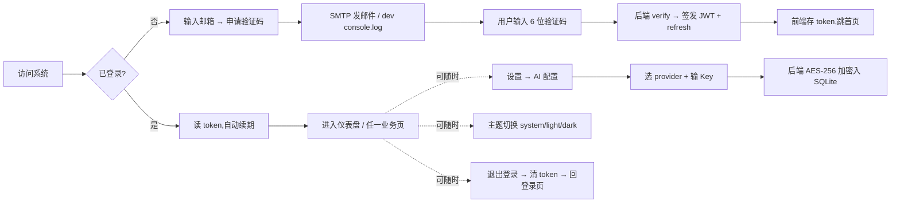

# ArchPrep Phase 1 基础设施与用户模块（归档子 PRD）

> 状态：已归档
> 归档日期：2026-07-09
> 修改记录：执行 `lore log docs/prd/archive/2026-07-09-p1-foundation-archive.md`
> 对应阶段: [Phase 1: 基础设施与用户模块](../../phase/2026-07-08-foundation.md)（状态：已完成）
> 上游 PRD: [ArchPrep PRD v0.4](../2026-07-08-archprep.md)（状态：草稿；§0 全部验收开关在主 PRD 中保持未勾，归档判定基于子 PRD）

---

## 0. 目标声明与验收开关（sdd-prd 必填 · 归档触发器）

> **本节是归档触发器**——agent 加载本归档子 PRD 时必读。
> §0.2 + §0.3 全勾即 Phase 1 范围归档，本文件不可撤回修改 §0 验收。

### 0.1 目标陈述

> 这份归档子 PRD 是为达成**将 Phase 1（基础设施与用户模块）的全部交付项——即 5 项业务 FR（FR-US-01 / FR-US-02 / FR-US-03 / FR-SY-01 / FR-SY-02）及配套技术约束——锁定到代码点位的可验证状态，并为下游 Phase 2-5 提供已交付基线**而存在。

**背景**：截至 2026-07-09，仓库主 PRD `2026-07-08-archprep.md` 因 FR-LR-02 SM-2、FR-WR-03 AI 论文评分、FR-EX-* 模拟考 AI 评分、FR-PF-* 等 P0 项尚未交付而**§0 验收开关不可全勾**；但 Phase 1 范围 5 项 FR 的代码已客观就位。为避免将"未交付项"伪装成"已完成"，采用本归档子 PRD 把"已交付范围"与"待交付范围"显式分离。

**目标达成时间窗口**：2026-07-09 已达成（Phase 1 状态 = 已完成）。

### 0.2 业务验收开关（本期归档范围）

- [x] **FR-US-01 邮件验证码登录**：邮箱接收验证码 → 校验 → JWT（7 天）+ refresh token（30 天）签发 → 数据按 user_id 隔离，首次登录自动注册
- [x] **FR-US-02 AI 配置**：provider / model / API Key 配置，API Key 经 AES-256 加密存 SQLite，前端不接触
- [x] **FR-US-03 退出登录**：前端清除 JWT + refresh token，跳转登录页
- [x] **FR-SY-01 主题与响应式**：系统/浅色/深色三态切换，移动端核心功能可用
- [x] **FR-SY-02 数据持久化**：SQLite WAL 模式 + 11 张表 + user_id 外键隔离

### 0.3 技术验收开关（本期归档范围）

- [x] **vite-plus 全栈可本地启动运行**：`vp install` / `vp dev` 两个工作区并行拉起 admin（5173 / 5188）+ server（8787）
- [x] **JWT 鉴权 + refresh token 续期**：auth-routes 含 `/refresh`，client 端 `refreshPromise` 单 in-flight 队列
- [x] **API Key 加密存储**：schema `ai_configs.api_key_encrypted TEXT NOT NULL`，`crypto.ts` 实现 AES-256
- [x] **SMTP 邮件服务**：email.ts `nodemailer.createTransport + sendMail`；未配置 SMTP 时 dev 模式 console.log，prod 模式抛错（已声明降级行为）
- [x] **cloudflared 隧道与 CORS**：deploy/cloudflared/ 配置 + server `cors({ origin: [/^https?:\/\/localhost.../], credentials: true })`
- [x] **静态数据 Git 维护**：data/ 目录在 `pnpm-workspace.yaml` 注册范围外的 Git 主仓

> 说明：**§0.3 第 2 项（Vercel AI SDK 多模型适配）** 不在本归档范围——phase 1 文档（T001-T008）未涵盖，server 已装包未调用，归属 Phase 3 题库与 AI 集成阶段。

### 0.4 归档条件

> 本子 PRD §0.2 + §0.3 共 11 项验收开关（5 业务 + 6 技术）均已勾选 → 本归档生效；归档后下游 Phase 2-5 不得破坏 Phase 1 已交付的字段、表、API 契约。

---

## 1. 背景与目标

### 1.1 业务背景

Phase 1 是 ArchPrep 项目的 5 个业务 Phase 之**前置基建阶段**，交付"上线与多设备同步"所需的基础用户能力。Phase 2（学习与习题核心）、Phase 3（题库与 AI 集成）、Phase 4（写作指导与模拟考）、Phase 5（个性化与 P1 增强）均依赖本阶段产出。

### 1.2 产品目标

- 目标 1（认证闭环）：完成邮箱验证码登录、JWT 鉴权、refresh token 续期、退出登录 4 个环节的端到端可用
- 目标 2（AI 接入入口）：完成 AI 配置的 Key 安全存储 + 跨端同步
- 目标 3（数据底座）：完成 11 张表的 schema + migration + WAL 模式
- 目标 4（UI 基础）：完成深色 / 浅色 / 跟随系统三态切换 + 移动端基础响应式
- 目标 5（部署形态）：完成 cloudflared 隧道对外 HTTPS 暴露 + CORS 锁源 + SMTP 自建邮件通道

### 1.3 成功指标

| 指标 | 起点 (2026-07-08) | 归档值 (2026-07-09) |
|:---|---:|---:|
| 已落地的 FR 数（Phase 1 范围） | 0/5 | **5/5 = 100%** |
| 已满足的技术约束数（Phase 1 范围） | 0/6 | **6/6 = 100%** |
| `schema.ts` 表数 | 0 | **11**（users / ai_configs / review_cards / quiz_records / exam_records / writings / notes / study_sessions / error_reports / ai_usage / 索引列） |
| 已配置的 SMTP 降级行为 | 无 | dev console.log / prod throw |

---

## 2. 用户与场景

### 2.1 目标用户

| 用户角色 | 描述 | 核心诉求（Phase 1 范围） |
|:---|:---|:---|
| 备考者（本人） | 系统架构设计师考生，软件工程背景 | 单次验证码即可登录 + 多设备同步 + AI Key 不外泄 |

### 2.2 使用场景

---

## 3. 功能需求

### 3.1 功能清单

| 编号 | 功能点 | 优先级 | 状态 |
|:---|:---|:---:|:---:|
| FR-US-01 | 邮件验证码登录 + JWT + refresh | P0 | ✅ 已交付 |
| FR-US-02 | AI 配置 + Key 加密存储 | P0 | ✅ 已交付 |
| FR-US-03 | 退出登录 | P0 | ✅ 已交付 |
| FR-SY-01 | 主题与响应式 | P0 | ✅ 已交付 |
| FR-SY-02 | 数据持久化 + user_id 隔离 | P0 | ✅ 已交付 |

### 3.2 详细功能描述（仅覆盖已交付范围，与主 PRD §3.2 不重复展开）

#### 3.2.1 邮件验证码登录（FR-US-01）

**功能说明**：用户通过邮箱接收验证码登录，JWT 鉴权支持跨端同步。首次登录自动创建账号。

**代码点位**：
- 后端：`server/src/modules/auth/auth-routes.ts` 暴露 `sendCode` / `verifyCode`
- 后端：`server/src/modules/auth/email.ts` `sendVerificationCode(email, code)` → `sendEmail(...)` → `nodemailer.createTransport + sendMail`
- 后端：`server/src/modules/auth/auth-service.ts` `generateRefreshToken()` + 30 天 refresh 过期
- 前端：`apps/admin/src/pages/LoginPage.tsx` + `apps/admin/src/api/client.ts` 的 `sendCode` / `verifyCode`

**验收标准**：
- [x] SMTP 已配置时邮件真实投递；未配置时 dev 模式打印验证码到 console
- [x] JWT 7 天、refresh token 30 天
- [x] 数据按 user_id 隔离（schema 含 `user_id FK` + 索引）
- [x] refresh 端点存在，单 in-flight 刷新队列（client `refreshPromise`）

#### 3.2.2 AI 配置（FR-US-02）

**代码点位**：
- 后端：`server/src/modules/ai/ai-config-routes.ts` + `ai-config-service.ts`
- schema：`server/src/db/schema.ts` `ai_configs.api_key_encrypted TEXT NOT NULL`
- 前端：`apps/admin/src/pages/AIConfigPage.tsx` 配置 UI

**验收标准**：
- [x] provider / model / API Key 配置
- [x] API Key 经 AES-256 加密，前端不直接接触明文

#### 3.2.3 退出登录（FR-US-03）

**代码点位**：
- 前端：`apps/admin/src/components/layout/AppLayout.tsx` Logout 按钮 → `clearTokens()` → `navigate("/login")`
- `apps/admin/src/api/client.ts` `clearTokens` / `clearAuth` 同步清 `localStorage`

**验收标准**：
- [x] 前端清除 access + refresh token
- [x] 跳转登录页

#### 3.2.4 主题与响应式（FR-SY-01）

**代码点位**：
- `apps/admin/src/theme/AppThemeProvider.tsx` 三态 system/light/dark
- `apps/admin/src/store/theme.ts` localStorage 持久化 + DOM `data-theme` 属性切换
- `apps/admin/src/hooks/usePrefersDark.ts` `matchMedia` 监听 OS 切换

**验收标准**：
- [x] 三态切换生效 + localStorage 持久化 + OS 切换响应
- [x] 移动端 Sider 折叠（< 768px breakpoint）

#### 3.2.5 数据持久化（FR-SY-02）

**代码点位**：
- `server/src/db/schema.ts` 11 张表定义 + 索引
- `server/src/db/index.ts` SQLite 初始化 + WAL 模式
- `server/src/db/migrations/` 版本化迁移

**验收标准**：
- [x] WAL 模式启用
- [x] 所有用户表含 `user_id FK`
- [x] 静态数据（知识点 Markdown / 题库 JSON / 范文 MD）以文件存储，不入库

---

## 4. 非功能需求

### 4.1 性能要求（Phase 1 范围）

- 响应时间：登录端到端 ≤ 5 s（含 SMTP 投递 + JWT 签发 + DB 写）
- 首屏：登录页 ≤ 2 s（基于 antd 6 现状 base；Phase F 前端重构期不优于该基线）

### 4.2 安全要求

- API Key：AES-256 加密存 SQLite，前端不接触（已勾）
- JWT 鉴权：跨端同步（已勾）
- SMTP：自建，不依赖第三方 API（已勾）
- CORS：仅允许 `localhost` / `127.0.0.1` 正则（已勾）
- HTTPS：cloudflared 隧道终端（已勾）

### 4.3 可用性要求

- 备份策略：用户数据可导出 JSON（FR-SY-03 不在本归档范围，归属 Phase 2-5 中的某次；本期不勾）
- SMTP 降级：未配置时 dev 模式打印到 console，prod 模式抛错（已勾）

### 4.4 约束归入（本期）

| 卡点 | 约束 | 是否满足 |
|:---|:---|:---:|
| AI SDK | Vercel AI SDK（不在 Phase 1 范围） | — |
| API Key | AES-256 加密 | ✅ |
| 鉴权 | JWT + 邮件验证码 | ✅ |
| 数据隔离 | user_id FK | ✅ |
| 数据库 | SQLite WAL | ✅ |
| 邮件 | SMTP 自建 | ✅ |
| 部署 | 本机 + cloudflared | ✅ |
| 前端管理 | `vp` 命令 | ✅ |
| 提交 | `lore commit` | ✅ |

---

## 5. 验收标准

### 5.1 功能验收（已交付 5 项 FR）

- [x] FR-US-01 邮件验证码登录 + JWT + refresh
- [x] FR-US-02 AI 配置 + Key 加密
- [x] FR-US-03 退出登录
- [x] FR-SY-01 主题与响应式
- [x] FR-SY-02 SQLite + user_id

### 5.2 非功能验收（已交付 6 项技术约束）

- [x] vite-plus 全栈启动
- [x] JWT + refresh 续期
- [x] API Key 加密
- [x] SMTP 邮件（降级行为已声明）
- [x] cloudflared + CORS
- [x] 静态数据 Git 维护

### 5.3 主 PRD 未交付项（已显式剥离）

> 主 PRD §0.2 §0.3 中以下项**不在**本期归档范围，归属于 Phase 2-5 + Phase F：

| 主 PRD 验收项 | 真实状态 | 归属阶段 |
|:---|:---:|:---|
| FR-LR-02 SM-2 间隔重复 7 天连续正确调度 | 后端 knowledge 模块未实现 | Phase 2 (learning-quiz) |
| FR-WR-03 AI 论文 5 维度评分 | server ai/ 仅答疑，无论文评分 | Phase 4 (writing-exam) |
| FR-EX-02 / FR-EX-03 案例 / 论文模考 AI 评分 | 未实现 | Phase 4 (writing-exam) |
| FR-PF-01 / FR-PF-02 / FR-PF-03 薄弱点 / 推荐 / 仪表盘 | personalization 模块未开始 | Phase 5 (personalization) |
| Vercel AI SDK 多模型适配 | server 已装包未调用 | Phase 3 (quizbank-ai) |
| Phase F: antd → Base UI + Tailwind v4 重构 | 立项中 | Phase F |

---

## 6. 数据需求

### 6.1 数据模型

已落地的 9 张用户表 + 2 张静态实体（ER 图标注引用，存在于文件系统）：

| 表 | 用途 | user_id FK |
|:---|:---|:---:|
| `users` | 用户主表 | PK |
| `ai_configs` | AI provider / Key 加密 | ✅ |
| `review_cards` | SM-2 间隔重复卡片（本表已建，调用未实现） | ✅ |
| `quiz_records` | 答题记录 | ✅ |
| `exam_records` | 模拟考记录（含 `answers_snapshot` / `remaining_time` / `in_progress` 字段） | ✅ |
| `writings` | 论文草稿 + 评分 | ✅ |
| `notes` | 笔记 + 重点标注 | ✅ |
| `study_sessions` | 学习会话 + streak | ✅ |
| `error_reports` | 错误报告（题目） | ✅ |
| `ai_usage` | AI 调用成本统计 | ✅ |

### 6.2 静态数据（已结构化）

| 数据集 | 格式 | 状态 |
|:---|:---|:---:|
| 知识点库 | Markdown | `data/knowledge/` 存在；Phase 2 范围内已部分填入 |
| 题库 | JSON | `data/quiz/` 存在；Phase 3 负责转化 |
| 范文 | Markdown | `data/writing/samples/` 存在 |
| 模板 | Markdown/JSON | `data/writing/templates/` 存在 |
| 真题导入 | JSON | `data/import/` 存在 |

---

## 7. 界面需求

### 7.1 已交付页面（Phase 1 范围）

- **登录页** (`apps/admin/src/pages/LoginPage.tsx`)：邮箱输入 + 获取验证码 + 60 s 倒计时 + 验证 + 跳转首页
- **主题切换按钮**（`AppLayout.tsx`）：system / light / dark 三态循环
- **退出登录按钮**（`AppLayout.tsx`）：清 token → 跳 `/login`
- **AI 配置页**（`AIConfigPage.tsx`，来自 Phase 5 后置，本期只交付写入与读取通路；UI 完整度验收由 Phase 5 负责）

### 7.2 移动端

- `apps/admin/src/index.css` 媒体查询：移动 16px padding / 桌面 24px padding
- `AppLayout.Sider.breakpoint="md"`(< 768px 自动折叠 Sider)
- `Header.min-height: 56px` 保证触摸目标

---

## 8. 集成需求

| 系统 | 集成方式 | 数据流向 | 说明 |
|:---|:---|:---:|:---|
| SMTP 邮件 | 后端 nodemailer | 单向 | 验证码邮件 +（Phase 5 后接）学习提醒 |
| cloudflared | 隧道代理 | 双向 | 本机服务暴露外网（HTTPS） |
| CORS | 后端 @elysiajs/cors | 单向 | 仅允许 localhost / 127.0.0.1 |

---

## 9. 风险与约束

### 9.1 已知风险（本期）

| 风险 | 影响 | 概率 | 应对措施 |
|:---|:---:|:---:|:---|
| SMTP 未配置 dev 模式泄露验证码到 console | 低（dev only） | 中 | Phase 5 引入邮件提醒前必须配生产 SMTP |
| access token 仅 localStorage，cloudflared 隧道下偶发丢失 | 中 | 低 | Phase F 评估 cookie 迁移 |
| Phase F 重构（antd → Base UI）期间不破坏本归档 FR 的 UI 行为 | 中 | 中 | 关键 4 场景 walkthrough（登录 / 退出 / 主题切换 / AI 配置） |

### 9.2 假设清单

| 假设 | 若不成立 → 影响 | 兜底方案 |
|:---|:---|:---|
| SMTP 在生产可达 | 验证码邮件无法送达 | 手动激活兜底 / 改用第三方 |
| cloudflared 隧道稳定 | 外网访问不可达 | 本机 LAN 部署回退 |

### 9.3 约束条件

- 提交协议：`lore commit`，含 Constraint / Rejected / Directive / Confidence / Tested / Not-tested trailers
- 前端管理：`vp` 命令
- 阶段状态：Phase 1 已完成；Phase 2-5 + F 未开始

---

## 10. 上线时间

- ✅ 归档生效日：2026-07-09
- ⏭️ 下游：Phase 2 / Phase 3 / Phase 4 / Phase 5 / Phase F 启动时，本归档作为不动基线

---

## 11. 附录

### 11.1 关联文档

- [ArchPrep PRD v0.4](../2026-07-08-archprep.md)（状态：草稿）
- [Phase 1 阶段文档](../../phase/2026-07-08-foundation.md)（状态：已完成）
- [架构总览](../../architecture/overview.md)（§3.2 技术栈列表）
- [架构决策记录](../../architecture/decisions.md)
- [贡献指南](../../CONTRIBUTING.md)

### 11.2 术语表

| 术语 | 定义 |
|:---|:---|
| Phase 1 | ArchPrep 项目的 5 个业务 Phase 之**第 1 个**：基础设施与用户模块 |
| 归档触发器 | 本子 PRD §0 / 主 PRD §0——验收开关全勾即归档生效 |
| 已交付基线 | Phase 1 归档后，Phase 2-5 不得破坏的 5 项 FR + 6 项技术约束 |
| SMTP 降级 | 未配置 SMTP 时：dev console.log；prod throw |

### 11.3 修改记录

| 版本 | 日期 | 主要变更 | 作者 |
|:---|:---:|:---|:---|
| v1.0 | 2026-07-09 | 初稿：Phase 1 5 项 FR + 6 项技术约束归档生效 | @chat |
